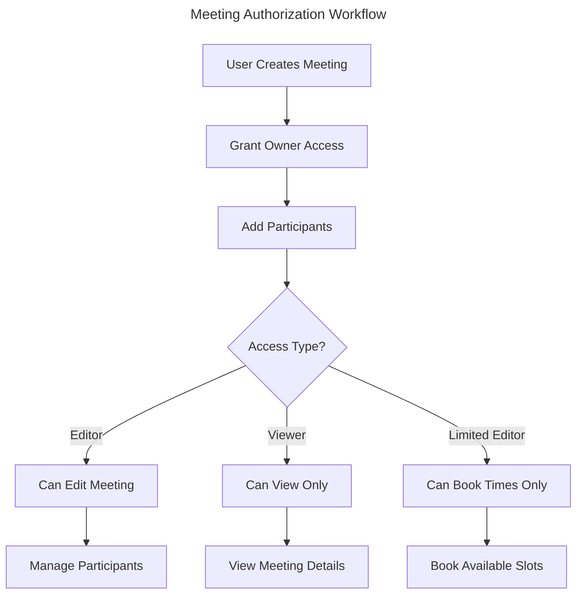

# Authorization System Implementation Guide

## Overview

We have successfully implemented a comprehensive authorization system that provides:

✅ **Flexible Role System** - Custom roles with package-specific permissions  
✅ **Package Registration Types** - Self-register, approval-required, and admin-only packages  
✅ **Resource-Level Access Control** - Granular permissions for specific resources (like meetings)  
✅ **Audit Logging** - Complete audit trail for all authorization events  
✅ **Caching Support** - Performance-optimized permission checking  
✅ **Meetings Integration** - Ready-to-use meeting authorization with owner/editor/viewer/limited-editor permissions  

## What Was Built

### 1. Database Schema (`packages/auth/prisma/schema.prisma`)

> 🆕 **New Models Added:**
> - `Package` - Registry of all packages with their registration types
> - `Role` - Flexible role system supporting both system and package-specific roles
> - `Permission` - OAuth-style permission scopes for packages
> - `RolePermission` - Many-to-many mapping between roles and permissions
> - `RoleAssignment` - User role assignments with optional resource context
> - `ResourceAccess` - Direct resource access control (e.g., meeting ownership)
> - `AuthAuditLog` - Complete audit trail for authorization events

### 2. Authorization Engine (`packages/shared/src/lib/authorization.ts`)

> ⚡ **Core Features:**
> - Permission checking with caching
> - Role and access management
> - Meeting-specific permission evaluation
> - Package access request handling
> - Audit logging for all operations

### 3. Authorization Middleware (`packages/shared/src/lib/middleware.ts`)

> 🛡️ **API Protection:**
> - `withAuthorization()` - General API route protection
> - `withMeetingAuthorization()` - Meeting-specific authorization
> - Utility functions for permission checking

### 4. Setup and Initialization (`packages/shared/src/lib/setup-authorization.ts`)

> 🔧 **System Setup:**
> - Default package, role, and permission creation
> - Meetings package initialization
> - Helper functions for granting/revoking meeting access

### 5. Type Definitions (`packages/shared/src/types.ts`)

> 📝 **TypeScript Support:**
> - Complete type definitions for all authorization entities
> - Enums for registration types, access types, and audit actions
> - Request/response interfaces for authorization operations

## Implementation Steps

### Phase 1: Database Setup ✅

1. **Update Auth Package Schema**
   ```bash
   cd packages/auth
   npx prisma db push  # Apply schema changes
   npx prisma generate # Generate client
   ```

### Phase 2: Initialize Authorization System

2. **Run Setup Script**
   ```typescript
   import { setupAuthorizationSystem } from '@sonnenreich/shared';
   import { PrismaClient } from '@prisma/client';
   
   const prisma = new PrismaClient();
   await setupAuthorizationSystem({ prisma, verbose: true });
   ```

### Phase 3: Integrate with Meetings Package

3. **Update Meeting Creation**
   ```typescript
   import { MeetingAuthService } from './lib/auth-integration';
   
   // Create meeting with automatic ownership
   const { meeting, permissions } = await MeetingAuthService.createMeetingWithOwnership(
     meetingData,
     userId
   );
   ```

4. **Protect API Routes**
   ```typescript
   import { withMeetingAuthorization } from '@sonnenreich/shared';
   
   // Protect meeting edit endpoint
   export const PUT = withMeetingAuthorization('edit')(async (req, { params }) => {
     const { meetingId } = await params;
     // User is authorized to edit this meeting
     // Meeting ID is available in req.meetingAuth.meetingId
   });
   ```

## Usage Examples

### Meeting Authorization Flow



### 1. Creating a Meeting with Authorization

```typescript
import { MeetingAuthService, AccessType } from '@sonnenreich/shared';

// Create meeting
const { meeting, permissions } = await MeetingAuthService.createMeetingWithOwnership({
  title: "Team Standup",
  description: "Daily team sync",
  duration: 30
}, userId);

// Add participants with different access levels
await MeetingAuthService.addMeetingParticipant(
  meeting.id,
  "participant1",
  AccessType.VIEWER,  // Can view meeting
  userId
);

await MeetingAuthService.addMeetingParticipant(
  meeting.id,
  "participant2", 
  AccessType.LIMITED_EDITOR,  // Can book time slots
  userId
);

await MeetingAuthService.addMeetingParticipant(
  meeting.id,
  "participant3",
  AccessType.EDITOR,  // Can edit meeting details
  userId
);
```

### 2. Checking Meeting Permissions

```typescript
import { checkMeetingPermissions } from '@sonnenreich/shared';

const permissions = await checkMeetingPermissions(userId, meetingId);

if (permissions.canEdit) {
  // Show edit UI
} else if (permissions.canView) {
  // Show read-only UI
} else {
  // Show access denied
}

// Specific permission checks
if (permissions.canBook) {
  // Show booking interface
}

if (permissions.canManageParticipants) {
  // Show participant management
}
```

### 3. Protecting API Routes

```typescript
// pages/api/meetings/[meetingId]/route.ts
import { withMeetingAuthorization, type AuthorizedRequest } from '@sonnenreich/shared';

// View meeting (requires view permission)
export const GET = withMeetingAuthorization('view')(
  async (req: AuthorizedRequest, { params }) => {
    const { meetingId } = await params;
    const userId = req.auth!.userId;
    
    const result = await MeetingAuthService.getMeetingWithPermissions(meetingId, userId);
    return NextResponse.json(result);
  }
);

// Edit meeting (requires edit permission)
export const PUT = withMeetingAuthorization('edit')(
  async (req: AuthorizedRequest, { params }) => {
    const { meetingId } = await params;
    const userId = req.auth!.userId;
    const updateData = await req.json();
    
    const meeting = await MeetingAuthService.updateMeeting(meetingId, updateData, userId);
    return NextResponse.json(meeting);
  }
);

// Delete meeting (requires delete permission)
export const DELETE = withMeetingAuthorization('delete')(
  async (req: AuthorizedRequest, { params }) => {
    const { meetingId } = await params;
    const userId = req.auth!.userId;
    
    await MeetingAuthService.deleteMeeting(meetingId, userId);
    return NextResponse.json({ success: true });
  }
);
```

### 4. Managing Meeting Participants

```typescript
// Add editor access
await MeetingAuthService.addMeetingParticipant(
  meetingId,
  newUserId,
  AccessType.EDITOR,
  ownerId
);

// Change access level (revoke old, grant new)
await MeetingAuthService.removeMeetingParticipant(
  meetingId,
  userId,
  AccessType.VIEWER,
  ownerId
);

await MeetingAuthService.addMeetingParticipant(
  meetingId,
  userId,
  AccessType.EDITOR,
  ownerId
);
```

## Access Control Matrix

| Permission | Owner | Editor | Viewer | Limited Editor |
|------------|-------|--------|--------|----------------|
| View Meeting | ✅ | ✅ | ✅ | ✅ |
| Edit Meeting Details | ✅ | ✅ | ❌ | ❌ |
| Delete Meeting | ✅ | ❌ | ❌ | ❌ |
| Manage Participants | ✅ | ✅ | ❌ | ❌ |
| Book Time Slots | ✅ | ✅ | ❌ | ✅ |
| Comment/Discuss | ✅ | ✅ | ✅ | ✅ |

## Package Registration Types

### Self-Register Packages
```typescript
// Users automatically get access
const result = await authEngine.requestPackageAccess(userId, {
  packageId: 'presentations'
});
// result.approved === true
```

### Approval-Required Packages  
```typescript
// Requires admin approval
const result = await authEngine.requestPackageAccess(userId, {
  packageId: 'meetings',
  reason: 'Need to schedule team meetings'
});
// result.approved === false, creates pending request
```

### Admin-Only Packages
```typescript
// Only admins can grant access
const result = await authEngine.requestPackageAccess(userId, {
  packageId: 'system-admin'
});
// result.approved === false, contact admin required
```

## Integration Checklist

### For New Packages

- [ ] **Register Package**: Add package entry with registration type
- [ ] **Define Permissions**: Create package-specific permission scopes
- [ ] **Create Roles**: Define roles and assign permissions
- [ ] **Protect Routes**: Add authorization middleware to API routes
- [ ] **Update UI**: Show/hide features based on user permissions
- [ ] **Test Access Control**: Verify all permission scenarios work

### For Existing Packages

- [ ] **Install Dependencies**: Add `@sonnenreich/shared` dependency
- [ ] **Initialize Authorization**: Run setup script for your package
- [ ] **Update Database**: Add resource access tracking
- [ ] **Retrofit APIs**: Add authorization checks to existing endpoints
- [ ] **Migration Script**: Grant appropriate access to existing resources
- [ ] **Update Frontend**: Implement permission-aware UI components

## Next Steps

### Phase 2: Enhanced Features (Recommended)

1. **React Hooks**: Create authorization hooks for frontend
2. **Admin UI**: Build interfaces for role and permission management  
3. **Approval Workflow**: Implement package access request/approval system
4. **Advanced Caching**: Add Redis support for better performance
5. **Role Inheritance**: Implement hierarchical role relationships

### Phase 3: Advanced Features

1. **Time-based Permissions**: Add temporal access control
2. **Conditional Permissions**: Context-aware permission evaluation
3. **External Integration**: Connect with external authorization providers
4. **Analytics Dashboard**: Authorization usage and security metrics
5. **Automated Testing**: Comprehensive authorization test suite

## Troubleshooting

### Common Issues

> **🔍 "Permission check failed"**  
> Ensure Prisma client is properly initialized in authorization engine

> **🔍 "Package not found"**  
> Run the setup script to initialize default packages and roles

> **🔍 "getUserIdFromSession not implemented"**  
> Implement session integration in `middleware.ts` for your auth system

> **🔍 "Database connection error"**  
> Verify DATABASE_URL environment variable is correctly set

### Debug Authorization

```typescript
// Enable verbose logging
const authEngine = getAuthorizationEngine({ 
  enableAuditLogging: true 
});

// Check user permissions
const permissions = await authEngine.getUserPermissions(userId, 'meetings');
console.log('User permissions:', permissions);

// Check specific permission
const result = await authEngine.checkPermission({
  userId,
  packageId: 'meetings',
  resourceType: 'meeting',
  resourceId: meetingId,
  action: 'meeting:edit'
});
console.log('Permission result:', result);
```

---

🎉 **The authorization system is now ready for production use!** This implementation provides enterprise-grade access control while maintaining the flexibility needed for your platform's growth. 