# r2dtax on busibox — plan

## 1. Where it lives

- **New private repo**: `github.com/jazzmind/r2dtax` (cloned from [busibox-template](https://github.com/jazzmind/busibox-template))
- App registered via `busibox.json` as `{ id: "r2dtax", defaultPort: 3012, appMode: "frontend" }`
- Agents, workflows, tools seeded into busibox's `agent_definitions` / `tool_definitions` / `workflow_definitions` tables by `seed_r2dtax_agents.py` that POSTs to `[/agents/definitions](https://github.com/jazzmind/busibox/blob/main/openapi/agent-api.yaml)`
- Staging plan file: `[docs/plans/r2dtax-busibox.md](docs/plans/r2dtax-busibox.md)` — copied to `r2dtax/docs/spec.md` when repo is created

## 2. Decisions (defaults)

- **Tax programs v1**: US §174/§41 (four-part test) + SBIR/STTR reporting, AU R&D Tax Incentive, UK RDEC + SME scheme, Canada SR&ED. All four with narrative templates.
- **Engineering ingestion v1**: GitHub + GitLab (PRs, commits, issues) + Jira (issues, epics, custom fields) + Linear (issues, projects, cycles). **Roadmap**: Google Docs, Confluence, Notion, Slack.
- **Capture model**: continuous (webhook-driven) + retrospective (pull history on connect). Classification is always async via scheduled workflow runs — never blocks user commits.
- **Narrative liability**: AI output flagged "DRAFT — requires human review"; every paragraph carries citations (source artifact IDs) the user can click through to verify.

## 3. Tax program encoding (`r2dtax/programs/*.yaml`)

Each program is a YAML definition ingested into `r2dtax.programs` at startup via seed script. Structured the same way OSCAL catalogs are in polysec — checklists + tests + narrative templates.

### US §41 four-part test (`programs/us-irc-41.yaml`)

```yaml
id: us-irc-41
country: US
jurisdiction: IRS
name: "IRC Section 41 Research Credit"
tax_years: ["2022+"]
tests:
  - id: permitted_purpose
    title: "Permitted purpose"
    criteria: "Activity intended to develop new or improved business component: function, performance, reliability, quality"
    evidence_kinds: [design_doc, pr_description, issue_description]
  - id: technological_uncertainty
    title: "Elimination of uncertainty"
    criteria: "Uncertainty existed at project outset re: capability, method, or appropriate design"
    evidence_kinds: [rfc, adr, spike_ticket, experiment_log]
  - id: process_of_experimentation
    title: "Process of experimentation"
    criteria: "Systematic evaluation of alternatives through modeling, simulation, trial and error"
    evidence_kinds: [experiment, ab_test, benchmark, branch_comparison]
  - id: technological_in_nature
    title: "Technological in nature"
    criteria: "Grounded in hard sciences: engineering, physical, biological, computer science"
    evidence_kinds: [code, technical_doc]
business_component_required: true
qualified_expenses:
  - wages_qualified_services
  - supplies
  - contract_research_65pct
  - cloud_compute
excluded_activities:
  - research_after_commercial_production
  - adaptation_of_existing
  - duplication
  - reverse_engineering
  - market_research
  - management_studies
narrative_template: templates/us-irc-41-narrative.md
```

### US §174 R&E expenditures (`programs/us-irc-174.yaml`)

- Tracks R&E expenditures requiring capitalization (5-year domestic / 15-year foreign amortization post-TCJA)
- Classification of each activity as domestic vs foreign
- Links to §41 QRE claims

### US SBIR/STTR (`programs/us-sbir-sttr.yaml`)

- Phase I/II/III reporting
- Technical progress narrative requirements per solicitation
- Commercialization plan tracking

### Australia ATO R&D Tax Incentive (`programs/au-rdti.yaml`)

- Core activities: experimental, systematic progression from hypothesis to logical conclusions, unknown outcome, purpose of generating new knowledge
- Supporting activities: directly related to core, dominant purpose of supporting
- Registration with AusIndustry by Apr 30 following income year
- R&D tax offset: 43.5% refundable (SME) or non-refundable (large)

### UK RDEC + SME (`programs/uk-rdec.yaml`, `programs/uk-sme.yaml`)

- BIS guidelines: "advance in overall knowledge or capability in science or technology through the resolution of scientific or technological uncertainty"
- Qualifying indirect activities list
- SME: staff costs + externally provided workers + subcontractors + software + consumables
- RDEC (large): 20% credit (Apr 2023+), different expense categories

### Canada SR&ED (`programs/ca-sred.yaml`)

- Basic research / applied research / experimental development
- Scientific or technological uncertainty + systematic investigation + technological advancement
- T661 form structure for filing
- Proxy vs traditional overhead methods

### Encoding strategy

- Programs are data, not code. Agents read them via `data_query("r2dtax.programs")`.
- Each test criterion has `evidence_kinds` tags that guide the classifier.
- `narrative_template` points to a markdown template with `{{placeholder}}` slots the narrative writer fills.

## 4. Data model (busibox data-api schemas)

All via [data-api](https://github.com/jazzmind/busibox/blob/main/openapi/data-api.yaml) `/data`. RLS handled by busibox.

- `r2dtax.programs` — tax program definitions loaded from YAML: `{id, country, jurisdiction, name, tests[], narrative_template, qualified_expenses[], excluded_activities[], ...}`
- `r2dtax.tax_years` — per-org per-program: `{id, program_id, year, claim_status: planning|in_progress|submitted|settled, due_at, filing_deadline}`
- `r2dtax.projects` — R&D projects: `{id, title, description, program_ids[], tax_year_ids[], business_component, owner_user_id, start_date, end_date, status: active|completed|excluded, tags[]}`
- `r2dtax.activities` — research activities within projects: `{id, project_id, title, kind: core|supporting, description, hypothesis, uncertainty_statement, methodology, expected_outcome, actual_outcome, status, start_date, end_date, test_coverage: {permitted_purpose: covered|partial|uncovered, technological_uncertainty: ..., ...}}`
- `r2dtax.experiments` — discrete hypothesis/method/result units: `{id, activity_id, hypothesis, method, variables_controlled, variables_measured, result, interpretation, success: yes|no|partial, evidence_ids[], started_at, ended_at}`
- `r2dtax.evidence` — linked engineering artifacts: `{id, kind: commit|pr|issue|ticket|design_doc|rfc|adr|experiment_log|benchmark|other, source: github|gitlab|jira|linear|upload|manual, source_ref: url, source_id, title, author_user_id, created_at, summary, activity_ids[], project_ids[], artifact_file_id?, data: jsonb (full payload), labels[]}`
- `r2dtax.time_entries` — time allocation: `{id, user_id, project_id, activity_id?, date, hours, confidence: manual|ai_inferred|ai_confirmed, source_refs[], rationale}`
- `r2dtax.narratives` — generated audit-defense prose: `{id, subject_type: project|activity|claim, subject_id, program_id, tax_year_id, version, status: draft|approved|superseded, body_markdown, citations[{segment_hash, evidence_id, relevance}], generated_at, approved_by_user_id, approved_at}`
- `r2dtax.classifications` — AI verdicts on evidence: `{id, evidence_id, program_id, is_rd_eligible: yes|no|maybe, ai_confidence, test_scores: {permitted_purpose: 0-1, ...}, ai_rationale, human_verdict: pending|accepted|rejected, human_note, suggested_activity_id?, updated_at}`
- `r2dtax.integrations` — per-org integration configs: `{id, type: github|gitlab|jira|linear, name, secrets_ref, scope: {repos?, projects?, workspaces?}, enabled, last_sync_at, last_status, schedule_cron, webhook_secret}`
- `r2dtax.claims` — year-end claim packages: `{id, tax_year_id, program_id, project_ids[], activity_ids[], narrative_id, total_qualified_expenses, expense_breakdown: {wages, supplies, contract, cloud}, supporting_evidence_bundle_file_id?, status: building|ready|submitted, filed_at, jurisdiction_filing_ref}`

### Schema strategy

- Separate data-api documents per schema, versioned.
- Evidence bytes (design docs, RFCs uploaded directly) go through busibox data-api `/upload` → chunked + embedded by `data-worker`, searchable via `/search`.
- External evidence (PR/issue text) stored as payload in `r2dtax.evidence.data` AND indexed as a virtual document via busibox's `/extract` endpoint so it's hybrid-searchable.

## 5. Agents (seeded into busibox `srv/agent`)

All agents defined in `r2dtax/agents/*.yaml`, loaded by `seed_r2dtax_agents.py`.

### Agents

- `r2dtax.rd_classifier` (Pydantic-AI, `fast` model)
  - Tools: `data_query` (programs, activities, evidence), `data_update` (classifications), `document_search`
  - Inputs: evidence item (PR/issue payload), program definitions
  - Output: `is_rd_eligible` + per-test scores + rationale + suggested activity assignment
  - Triggered by: webhook events (PR merged, issue closed) → writes to `r2dtax.classifications` for human review
- `r2dtax.experiment_extractor` (Pydantic-AI, `agent` model)
  - Tools: `data_query` (evidence), `create_data` (experiments), `document_search`
  - Inputs: evidence items for a project, optionally a time window
  - Output: structured `{hypothesis, method, variables, result, interpretation}` rows
  - Parses commit sequences, PR discussions, linked tickets for investigation patterns
- `r2dtax.narrative_writer` (Pydantic-AI, `agent` complex tier, large context)
  - Tools: `data_query`, `document_search`, `rag_query` (policies + evidence), `create_data` (narratives)
  - Inputs: `{subject_type, subject_id, program_id, tax_year_id}`
  - Output: narrative markdown with inline citations `[ev:id]`, scored against program `narrative_template` slots
  - Writes version history; old narratives go `superseded`, not deleted
- `r2dtax.time_inferencer` (Pydantic-AI, `fast` model)
  - Tools: `data_query` (evidence, time_entries), `create_data` (time_entries)
  - Inputs: user + date range + candidate activities
  - Output: suggested time splits with rationale (commit counts, PR size, ticket hours, meeting presence)
  - User confirms/edits before entries become `ai_confirmed`
- `r2dtax.gap_auditor` (Pydantic-AI, `agent` model)
  - Tools: `data_query`, `data_aggregate`, `create_data` (gaps)
  - Inputs: claim + program
  - Output: per-activity audit-readiness scorecard (which four-part test criteria lack evidence, which narrative slots are weak, which expenses are undocumented)
  - Blocks claim submission if critical gaps exist
- `r2dtax.capture_coach` (Pydantic-AI, conversational, via busibox `/chat/message/stream`)
  - Tools: `data_query`, `document_search`, `create_task`, `send_notification`
  - Conversational: helps engineers tag work at commit-time ("Was this PR experimental? What was the uncertainty?")
  - Accessible from the app and from bridge channels (Slack DM, Telegram) via `bridge` service

### Tools (new, defined via `/agents/tools`)

- `r2dtax_program_lookup({ program_id }) -> program` — cached
- `r2dtax_evidence_link({ evidence_id, activity_id, project_id, label? })` — mutation convenience
- `r2dtax_classify_score({ evidence, program_id }) -> test_scores` — used internally by classifier; also exposed for UI "why?" debugging
- `r2dtax_ingest_webhook({ source, payload })` — called by webhook endpoints; fans out to classifier
- `r2dtax_notify({ user_id, channel, title, body, link })` — bridge wrapper

### Workflows (`/agents/workflows`)

- `r2dtax.on_pr_merged` — GitHub/GitLab webhook → `rd_classifier` → (if eligible) `experiment_extractor`
- `r2dtax.on_ticket_closed` — Jira/Linear webhook → `rd_classifier`
- `r2dtax.daily_backfill` — cron `0 3 * * *` → pull any missed events + classify → `rd_classifier` batch
- `r2dtax.weekly_capture_digest` — cron `0 9 * * 1` → `capture_coach` sends per-user digest of flagged items needing their input
- `r2dtax.monthly_project_review` — cron `0 9 1 * *` → `gap_auditor` reports per-project audit-readiness to owners
- `r2dtax.claim_compile` — manually triggered at year-end → `gap_auditor` → `narrative_writer` (per activity + overall) → assemble evidence bundle → produce claim PDF

### Guardrails

- `tool_calls_limit=30` (already in busibox via Pydantic-AI `UsageLimits`)
- Per-run `timeout_s`: `rd_classifier=60`, `experiment_extractor=180`, `narrative_writer=600`, `gap_auditor=300`, `claim_compile=1800`
- **Cost ceiling** (requires busibox enhancement — see busibox-agent-modernization plan): hard stop `$0.25/run` for classifier, `$1.00/run` for narrative writer, `$5.00/run` for claim compile
- **PII guardrail**: classifier must not include author names or commit SHAs in LLM prompts beyond their references — use ID maps and reconstruct in post-processing

## 6. Engineering integrations (`lib/integrations/`*)

### GitHub (`lib/integrations/github.ts`)

- GitHub App install (org-level, not OAuth per-user)
- Webhooks: `pull_request.closed` (merged only), `issues.closed`, `push` (filtered to non-merge commits on default branch)
- Pull: PR body + review comments + linked issues + file diffs (summary stats, not full content), commit messages
- Backfill: REST API paginated pull of last 2 tax years on connect
- Refresh: webhook-driven + daily safety sync

### GitLab (`lib/integrations/gitlab.ts`)

- Same shape as GitHub; uses GitLab webhooks + REST API
- MR merged, issue closed, push events

### Jira (`lib/integrations/jira.ts`)

- OAuth 2.0 (3LO) app; Atlassian Connect alternative for Data Center
- Webhooks: `jira:issue_updated` (status transitions), `jira:issue_created`
- Pull: issue body + comments + custom fields (configurable mapping — e.g. "Hypothesis" custom field → evidence record), epics, sprints
- JQL-based scoping per integration config

### Linear (`lib/integrations/linear.ts`)

- OAuth 2.0
- Webhooks: Issue, Project, Comment resources
- Pull: issue body + comments + project context + cycle info

### Ingest pipeline

```mermaid
flowchart LR
    hook[Webhook endpoint] --> normalize[Normalize to r2dtax.evidence shape]
    normalize --> writeEvidence[Insert r2dtax.evidence]
    writeEvidence --> extractDoc["data-api /extract (text-only indexing)"]
    extractDoc --> enqueueClassify[Enqueue rd_classifier run]
    enqueueClassify --> agentApi["agent-api /runs"]
    agentApi --> classified[r2dtax.classifications]
    classified -->|"if eligible"| extractorRun[Enqueue experiment_extractor]
    extractorRun --> experiments[r2dtax.experiments]
```




### Secrets

- Tokens and webhook secrets stored in busibox vault (via `authz` service); `r2dtax.integrations.secrets_ref` holds the vault key only

## 7. Continuous capture (the differentiator)

- Default mode: webhook-driven near-real-time classification.
- Inbox pattern at `/r2dtax/capture` — every new classification with `is_rd_eligible in {yes, maybe}` appears for the author to confirm/reject/reassign.
- `capture_coach` agent accessible from Slack/Telegram via bridge — engineer types "/r2dtax" and the bot asks about their recent work.
- Weekly digest email/Slack to each contributor: "15 PRs this week — 8 classified R&D, 3 need your input, 4 classified non-R&D" with one-click confirm links.
- Result: by year-end, 80%+ of activities already have classified evidence + draft narratives; claim compile is review-and-approve, not reconstruct-from-scratch.

## 8. UI surface (Next.js 16 App Router in r2dtax repo)

Navigation inside `app/(authenticated)/`:

- `/r2dtax` — dashboard: active tax years, per-program claim readiness %, inbox count, upcoming deadlines
- `/r2dtax/programs` — configure which programs apply to this org; inspect program definitions
- `/r2dtax/tax-years` — list + filing deadlines; claim status per program
- `/r2dtax/projects` — CRUD; list with activity counts, evidence counts, readiness score
- `/r2dtax/projects/[id]` — project detail: activities, experiments, evidence, narrative, time allocation
- `/r2dtax/projects/[id]/activities/[aid]` — activity detail: hypothesis/method, test coverage chips, evidence, experiments, narrative section
- `/r2dtax/projects/[id]/experiments/[eid]` — experiment detail: hypothesis/method/variables/result; link to source evidence
- `/r2dtax/capture` — classification inbox: flagged PRs/tickets awaiting confirmation
- `/r2dtax/evidence` — full evidence library with filters (source, kind, labels, date, project)
- `/r2dtax/narratives` — generated narratives across projects; versioning; approve/revise
- `/r2dtax/time` — time entry UI (manual + AI-suggested); weekly timesheet view
- `/r2dtax/claims` — compile year-end claim; preview; export (PDF + supporting evidence ZIP)
- `/r2dtax/integrations` — connect GitHub/GitLab/Jira/Linear; scope config; last sync
- `/r2dtax/audit` — audit simulation: "what would an IRS/ATO/HMRC/CRA auditor find missing?" → gap_auditor report
- `/r2dtax/settings` — notification channels, capture coach preferences, narrative review policy, expense category mapping

### Reused from `@jazzmind/busibox-app`

- `Header`, `Footer`, `SessionProvider` — layout + auth
- `SimpleChatInterface` — wrapped as the capture coach chat widget (right-side drawer on all pages)
- Data API client for all CRUD

## 9. Implementation phases

### Phase 0 — repo bootstrap (2 days)

- Clone [busibox-template](https://github.com/jazzmind/busibox-template), rename to r2dtax
- Update `busibox.json`, `package.json`, `env.example`
- Delete demo routes per `DEMO.md`
- Set up `docs/spec.md` from this plan

### Phase 1 — program encoding + data model (1.5 weeks)

- Encode all four jurisdictions + SBIR/STTR as YAML program definitions in `programs/`
- `seed_r2dtax_programs.py` inserts into `r2dtax.programs`
- Define all `AppDataSchema`s in `lib/data-api-client.ts` with typed CRUD helpers
- UI: `/r2dtax/programs` (read-only) + `/r2dtax/tax-years` basic CRUD

### Phase 2 — project/activity/experiment CRUD + manual evidence (1.5 weeks)

- `/r2dtax/projects` + drill-ins with full CRUD
- Manual evidence upload (uses busibox `/upload`)
- Manual evidence linking to activities
- Activity test-coverage UI (manual mark covered/partial/uncovered per test)

### Phase 3 — engineering integrations (2 weeks)

- Week 1: GitHub + GitLab webhook ingest + backfill
- Week 2: Jira + Linear ingest
- Each normalizes to `r2dtax.evidence` shape
- Integration config UI at `/r2dtax/integrations`

### Phase 4 — classifier + extractor agents (1.5 weeks)

- `seed_r2dtax_agents.py` script
- `rd_classifier` agent + `on_pr_merged` / `on_ticket_closed` workflows
- `experiment_extractor` agent
- `/r2dtax/capture` inbox UI with confirm/reject/reassign
- Classifier debugging view (test scores + rationale)

### Phase 5 — narrative writer + time inferencer (1.5 weeks)

- `narrative_writer` agent with versioning + citations
- Narrative review UI with side-by-side evidence
- `time_inferencer` agent + weekly timesheet UI
- Bridge notifications for weekly digests

### Phase 6 — gap auditor + claim compiler (1.5 weeks)

- `gap_auditor` agent + `/r2dtax/audit` UI
- `claim_compile` workflow
- `/r2dtax/claims` UI with compile → preview → export
- PDF generation via busibox Playwright service
- Evidence bundle ZIP assembly

### Phase 7 — capture coach + polish (1 week)

- `capture_coach` conversational agent
- In-app chat drawer (SimpleChatInterface wrapper)
- Slack/Telegram bridge integration
- Eval harness for classifier (see busibox-agent-modernization plan)
- Documentation: admin guide, claim process guide per jurisdiction, disclaimer language
- Public launch checklist: LICENSE (source-available or commercial), disclaimers, jurisdiction attribution

**Total**: ~11 weeks focused

## 10. Known risks / open questions

- **Tax advice liability**: r2dtax produces **draft** narratives for accountant/agent review. Hard-coded disclaimer on every export: "Not tax or legal advice. Review with qualified tax counsel before filing." Every narrative carries a "human-approved-by" requirement before claim inclusion.
- **Program text copyright**: IRS/ATO/HMRC/CRA publications are public-domain or open-government-license. SBIR solicitations too. Our YAML paraphrases + cites — documented in `programs/README.md`. No redistribution risk.
- **Webhook reliability**: all webhook endpoints must also support `daily_backfill` as a safety net (already in plan).
- **False positives in classification**: an engineer who doesn't trust the inbox stops using r2dtax. Classifier needs tight precision over recall for `yes`, generous recall for `maybe`. Tune against ground-truth labels in eval harness.
- **Narrative hallucination**: every factual claim in a narrative must cite an evidence ID. `narrative_writer` prompts include "if you cannot cite it, do not claim it." Eval harness checks citation density + citation grounding.
- **Jurisdiction combinatorics**: UK RDEC/SME eligibility changes at 500 staff + revenue thresholds; AU tiers at $20M aggregated turnover; SR&ED has flow-through rules. v1 captures user-declared tier; v2 flags eligibility-threshold changes during the year.
- **Time-tracking accuracy**: commit/ticket activity is a weak proxy for hours. `time_inferencer` suggestions must be human-confirmed — never auto-inserted as authoritative. Export clearly labels `manual` vs `ai_confirmed` vs `ai_inferred`.
- **Integration scope creep**: Jira custom fields vary wildly per org. v1 ships a configurable field-mapping UI; defaults handle the 3-4 most common fields (Acceptance Criteria, Definition of Done, Hypothesis, Technical Uncertainty).

