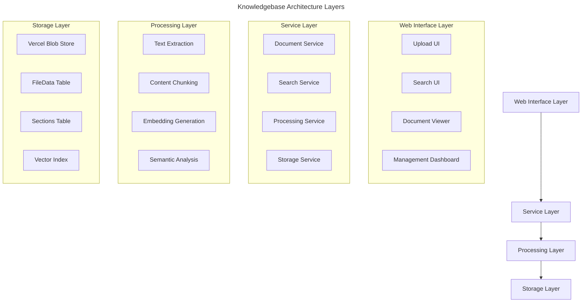
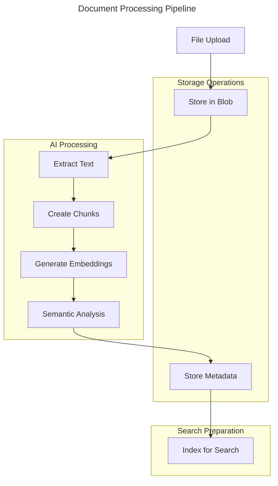

# Knowledgebase Package Architecture

## Overview

The knowledgebase package provides comprehensive document management, processing, and semantic search capabilities. It's designed for dual-mode operation: standalone application and composable package for integration into larger platforms.

## Core Capabilities

- **Document Ingestion**: Support for PDF, DOCX, TXT, and other formats
- **Text Extraction**: High-quality content extraction with metadata preservation
- **Semantic Processing**: AI-powered content analysis and section identification
- **Vector Search**: Embedding-based similarity search and matching
- **Document Reconstruction**: Ability to reconstruct original documents from chunks
- **Multi-tenant Support**: Organization-based data isolation
- **Web Interface**: Complete UI for document management and search

## Architecture Principles

### 1. Dual-Mode Design
- **Standalone**: Complete Next.js application with routing and UI
- **Composable**: Exportable services and components for integration

### 2. Layered Architecture


### 3. Data Flow


## Core Components

### 1. Document Service (`DocumentService`)
- File upload and storage management
- Metadata tracking and validation
- Document retrieval and reconstruction
- Progress tracking for long operations

### 2. Text Extraction Service (`TextExtractionService`)
- PDF text and image extraction
- DOCX content parsing
- Plain text processing
- Content cleaning and normalization

### 3. Embedding Service (`EmbeddingService`)
- OpenAI embedding generation
- Batch processing optimization
- Vector similarity calculations
- Embedding storage and retrieval

### 4. Semantic Analysis Service (`SemanticAnalysisService`)
- AI-powered content sectioning
- Topic identification and categorization
- Content classification
- Section relationship mapping

### 5. Search Service (`SearchService`)
- Vector-based similarity search
- Hybrid text and semantic search
- Result ranking and filtering
- Context reconstruction

## Data Models

### FileData Model
```typescript
interface FileDataRecord {
  id: string;
  fileId: string;           // Blob storage reference
  entityType: string;       // 'opportunity' | 'knowledgebase' | 'polysec'
  entityId: string;         // Parent entity ID
  dataType: string;         // 'extractedText' | 'chunk' | 'fileMetadata'
  chunkIndex?: number;      // For content chunks
  totalChunks?: number;     // Total chunks in file
  content?: string;         // Extracted text content
  contentHash?: string;     // Deduplication hash
  metadata?: Json;          // Processing metadata
  organizationId: string;   // Multi-tenant isolation
}
```

### Sections Model
```typescript
interface SectionRecord {
  id: string;
  sectionGroupId: string;   // Groups versions of same section
  entityType: string;       // 'opportunity' | 'knowledgebase' | 'polysec'
  entityId: string;         // Parent entity ID
  type: string;            // 'text' | 'fields'
  title: string;
  content?: string;        // Section content
  version: number;         // Version tracking
  order: number;           // Display order
  isActive: boolean;       // Current version flag
  organizationId: string;  // Multi-tenant isolation
}
```

### Vector Model
```typescript
interface VectorRecord {
  id: string;
  entityType: string;       // 'knowledgebase' | 'polysec'
  entityId: string;         // Parent entity ID
  sourceEntityType?: string; // 'FileData' | 'Section'
  sourceEntityId?: string;   // Source record ID
  contentHash?: string;      // Content deduplication
  vector: Json;             // Embedding array
  metadata?: Json;          // Search metadata
}
```

## API Contracts

### Upload API
```typescript
POST /api/documents/upload
Content-Type: multipart/form-data

Request:
- file: File
- entityType: string
- entityId: string
- organizationId: string

Response:
{
  success: boolean;
  fileId: string;
  processingId: string;
  message: string;
}
```

### Search API
```typescript
POST /api/search
Content-Type: application/json

Request:
{
  query: string;
  entityType: string;
  entityId: string;
  limit?: number;
  threshold?: number;
}

Response:
{
  results: Array<{
    content: string;
    similarity: number;
    source: {
      fileId: string;
      filename: string;
      chunkIndex: number;
    };
    metadata: object;
  }>;
  totalResults: number;
  searchTime: number;
}
```

### Processing Status API
```typescript
GET /api/processing/{processingId}/status

Response:
{
  status: 'processing' | 'completed' | 'failed';
  progress: {
    stage: string;
    current: number;
    total: number;
    message: string;
  };
  result?: {
    documentsProcessed: number;
    sectionsCreated: number;
    embeddingsGenerated: number;
  };
}
```

## Integration Patterns

### Standalone Mode
```typescript
// pages/index.tsx
import { KnowledgebaseApp } from '@/knowledgebase';

export default function Page() {
  return <KnowledgebaseApp />;
}
```

### Component Mode
```typescript
// Using in another application
import { 
  DocumentUpload, 
  SearchInterface, 
  DocumentService 
} from '@/knowledgebase';

export default function MyApp() {
  return (
    <div>
      <DocumentUpload 
        entityType="polysec"
        entityId="policy-db"
        onUploadComplete={handleUpload}
      />
      <SearchInterface 
        entityType="polysec"
        entityId="policy-db"
        onResultSelect={handleResult}
      />
    </div>
  );
}
```

### Service Integration
```typescript
// Using services directly
import { DocumentService, SearchService } from '@/knowledgebase';

const docService = new DocumentService();
const searchService = new SearchService();

// Upload and process document
const result = await docService.uploadAndProcess(file, {
  entityType: 'polysec',
  entityId: 'policy-db',
  organizationId: 'org-123'
});

// Search documents
const searchResults = await searchService.search(query, {
  entityType: 'polysec',
  entityId: 'policy-db',
  limit: 10
});
```

## Technology Stack

### Core Dependencies
- **Next.js 15**: App Router and React Server Components
- **TypeScript**: Strict typing
- **Prisma**: Database ORM
- **Vercel Blob**: File storage
- **OpenAI**: Embeddings and text processing

### Processing Libraries
- **pdf-parse**: PDF text extraction
- **mammoth**: DOCX processing
- **cheerio**: HTML content parsing
- **sharp**: Image processing

### UI Components
- **Tailwind CSS**: Styling
- **Radix UI**: Accessible components
- **React Hook Form**: Form handling
- **React Query**: Data fetching

## Security Considerations

### Access Control
- Organization-based data isolation
- File access permissions
- API authentication required
- Content sanitization

### Data Protection
- Files encrypted at rest in blob storage
- Sensitive content detection
- Audit logging for all operations
- GDPR compliance considerations

### Processing Security
- Input validation for all file types
- Malware scanning integration points
- Rate limiting for API endpoints
- Content filtering capabilities

## Performance Optimizations

### File Processing
- Streaming upload for large files
- Background processing with progress tracking
- Chunk-based processing for memory efficiency
- Parallel embedding generation

### Search Performance
- Vector index optimization
- Result caching strategies
- Pagination for large result sets
- Search query optimization

### Storage Efficiency
- Content deduplication by hash
- Compression for text content
- Efficient chunk storage strategy
- Cleanup of orphaned data

## Future Extensions

### Advanced Features
- OCR for scanned documents
- Multi-language support
- Real-time collaboration
- Version control for documents

### Integration Capabilities
- Webhook notifications
- Third-party storage adapters
- Custom embedding providers
- Plugin architecture for processors

## Implementation Phases

### Phase 1: MVP Foundation (Parallel Development Ready)
**Status**: ✅ **COMPLETE - Ready for PolySec Integration**

**Available Functionality**:
1. ✅ Document upload to Vercel blob storage
2. ✅ File metadata storage and management
3. ✅ Complete UI component library
4. ✅ Document listing and basic management
5. ✅ Mock search interface (functional UI)
6. ✅ Document viewer with mock content
7. ✅ Full TypeScript types and interfaces

**Integration Capabilities**:
- PolySec can start building policy management UI
- Document upload and storage works end-to-end
- Component integration is fully functional
- File management operations are complete

> 🚀 **MVP Integration Point**: PolySec development can begin now using the knowledgebase package. All UI components work with mock data, and file storage is fully functional.

### Phase 2: Core Processing (Enhances Existing Features)
**Status**: 🚧 **IN PROGRESS - Enhances Phase 1**

**Target Functionality**:
1. 🔄 Real text extraction (PDF, DOCX, TXT)
2. 🔄 Content chunking and storage
3. 🔄 Basic text search (database queries)
4. 🔄 Document content display
5. 🔄 Progress tracking for processing

**Integration Impact**:
- Enhances existing upload flow with real processing
- Replaces mock search with actual text search
- Document viewer shows real extracted content
- **No breaking changes to existing integrations**

### Phase 3: AI-Powered Features (Advanced Capabilities)
**Status**: 📅 **PLANNED - Advanced Features**

**Target Functionality**:
1. 📅 OpenAI embedding generation
2. 📅 Vector similarity search
3. 📅 Semantic content analysis
4. 📅 AI-powered document sectioning
5. 📅 Intelligent answer generation

**Integration Impact**:
- Significantly improves search quality and relevance
- Adds semantic capabilities for PolySec questionnaire features
- **Backward compatible with Phase 2 implementations**

### Phase 4: Enterprise Features (Production Ready)
**Status**: 📅 **FUTURE - Enterprise Scale**

**Target Functionality**:
1. 📅 Advanced analytics and reporting
2. 📅 Multi-language support
3. 📅 OCR for scanned documents
4. 📅 Real-time collaboration features
5. 📅 Advanced compliance reporting

## Parallel Development Strategy

### For PolySec Team
```typescript
// Start building now with current functionality
import { 
  KnowledgebaseApp, 
  DocumentUpload, 
  SearchInterface 
} from '@jazzmind/knowledgebase';

// This works today:
<DocumentUpload 
  entityType="polysec"
  entityId="policy-database"
  organizationId="your-org"
  onUploadComplete={(result) => {
    // File is uploaded and stored
    console.log('Document uploaded:', result.fileId);
  }}
/>

// Search interface works with mock data initially
<SearchInterface 
  entityType="polysec"
  entityId="policy-database"
  organizationId="your-org"
  onSearch={(query, results) => {
    // Mock results initially, real search in Phase 2
    handleSearchResults(results);
  }}
/>
```

### Phase Transition Plan
1. **Phase 1 → Phase 2**: Seamless upgrade, mock data replaced with real processing
2. **Phase 2 → Phase 3**: Enhanced search capabilities, backward compatible
3. **Phase 3 → Phase 4**: Additional features, no breaking changes

### Development Milestones

#### Milestone 1: MVP Integration (✅ Complete)
- [x] PolySec can start UI development
- [x] File upload and storage working
- [x] Component library complete
- [x] TypeScript integration ready

#### Milestone 2: Basic Processing (Week 2-3)
- [ ] Text extraction implementation
- [ ] Database text search
- [ ] Real document viewing
- [ ] Progress tracking

#### Milestone 3: AI Features (Week 4-6)
- [ ] Vector embeddings
- [ ] Semantic search
- [ ] Answer generation
- [ ] Advanced analytics

### Risk Mitigation
- **UI Components**: Already stable and feature-complete
- **API Contracts**: Designed for backward compatibility
- **Data Models**: Support progressive enhancement
- **Integration Points**: Well-defined interfaces minimize coupling

---

This architecture provides a solid foundation for building a comprehensive knowledgebase that can serve both polysec requirements and be reusable across other projects in the platform. 