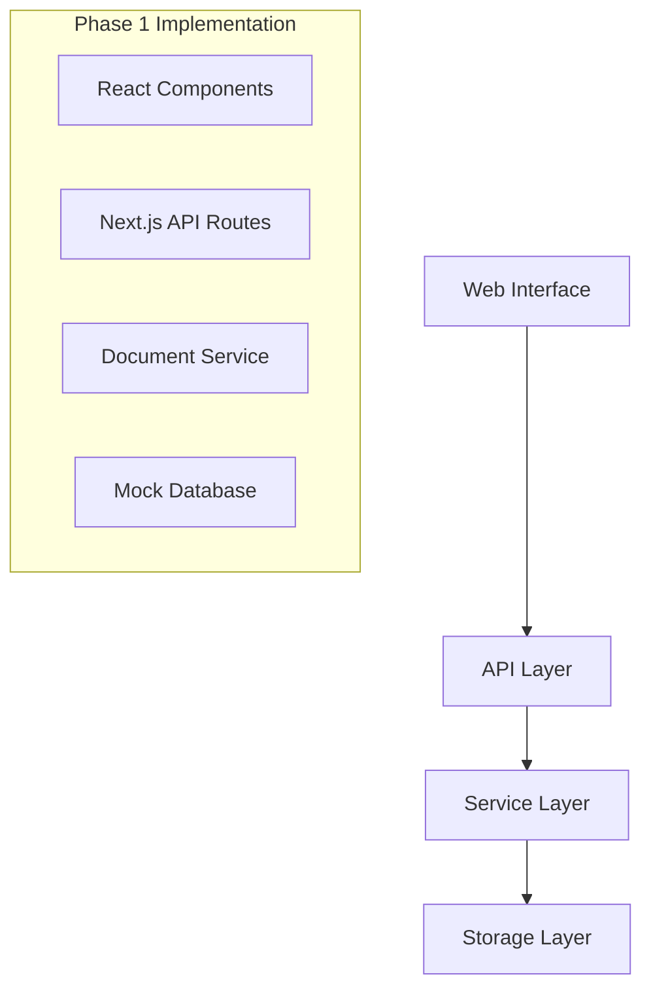

# PolySec - AI-Powered Security Policy Management System

A comprehensive AI-powered security policy management system that processes policy documents, answers security questionnaires, and performs compliance analysis using advanced semantic search and natural language processing.

## 🚀 Production Ready with AI Integration ✅

**Status**: Production Ready with Full AI Capabilities

### 🎯 Core Features

- **🤖 AI-Powered Document Processing**: Upload PDF, DOCX, and TXT files with automatic text extraction, chunking, and vector embedding generation
- **🔍 Semantic Search**: Advanced pgvector-based similarity search for finding relevant policy information
- **❓ AI Security Questionnaire**: Get instant answers to compliance questions based on your policy documents
- **📋 Compliance Frameworks**: Built-in support for SOC 2, ISO 27001, PCI DSS, and custom frameworks
- **🎯 Policy Analysis**: AI-powered content analysis and section identification
- **📊 Confidence Scoring**: Each answer includes confidence levels and source document references
- **🌐 Web Interface**: Modern, responsive UI with tabbed navigation and real-time processing

### Technology Stack

- **Framework**: Next.js 15 with App Router
- **Language**: TypeScript
- **Styling**: Tailwind CSS v4
- **AI & Search**: OpenAI GPT-4 + text-embedding-3-small, pgvector
- **Storage**: Knowledgebase integration with Vercel blob storage
- **Database**: PostgreSQL with pgvector extension
- **Processing**: Real-time document processing and vector embedding generation
- **Architecture**: Dual-mode (standalone app + composable package)

## Quick Start

### Installation

```bash
cd platform/packages/polysec
npm install
```

### Development

```bash
# Start development server
npm run dev

# The app will be available at http://localhost:3002
```

### Using as Standalone Application

Visit `http://localhost:3002` to access the full PolySec interface.

### Using as Composable Package

```typescript
import { PolySec, DocumentUpload, DocumentList } from 'polysec';

// Use the full application
function MyApp() {
  return <PolySec />;
}

// Or use individual components
function MyDocumentManager() {
  const handleUploadSuccess = () => {
    console.log('Document uploaded successfully');
  };

  const handleDocumentSelect = (document) => {
    console.log('Document selected:', document);
  };

  return (
    <div>
      <DocumentUpload onUploadSuccess={handleUploadSuccess} />
      <DocumentList onDocumentSelect={handleDocumentSelect} />
    </div>
  );
}
```

## API Endpoints

### Document Upload
```http
POST /api/documents/upload
Content-Type: multipart/form-data

# Form fields:
# - file: File (required)
# - title: string (optional) 
# - version: string (optional)
# - organizationId: string (optional)
```

### List Documents
```http
GET /api/documents?fileType=PDF&status=COMPLETED&limit=10&offset=0&organizationId=org-123
```

### Get Document
```http
GET /api/documents/{id}?organizationId=org-123
```

### Delete Document
```http
DELETE /api/documents/{id}?organizationId=org-123
```

### 🔒 Security Questionnaire
```http
POST /api/security/questionnaire
Content-Type: application/json

{
  "questions": [
    "What is your data encryption policy?",
    "How do you handle incident response?"
  ],
  "organizationId": "org-123"
}
```

### Get Questionnaire Templates
```http
GET /api/security/questionnaire?framework=soc2
# Available frameworks: soc2, iso27001, pci, general
```

## File Support

| Format | Extension | Max Size | Status |
|--------|-----------|----------|---------|
| PDF | `.pdf` | 100MB | ✅ Phase 1 (placeholder extraction) |
| DOCX | `.docx` | 100MB | ✅ Phase 1 (placeholder extraction) |
| TXT | `.txt` | 100MB | ✅ Phase 1 (full extraction) |

## Project Structure

```
src/
├── app/                    # Next.js app router
│   ├── api/               # API routes
│   │   └── documents/     # Document management endpoints
│   ├── globals.css        # Global styles
│   ├── layout.tsx         # Root layout
│   └── page.tsx           # Main application page
├── components/            # React components
│   ├── polysec.tsx        # Main dashboard component
│   ├── document-upload.tsx # File upload component
│   ├── document-list.tsx   # Document list/table
│   ├── document-viewer.tsx # Document viewer
│   └── index.ts           # Component exports
├── lib/                   # Services and utilities
│   ├── services/          # Business logic
│   │   ├── document-service.ts     # Document management
│   │   └── text-extraction-service.ts # Text processing
│   └── utils.ts           # Utility functions
├── types/                 # TypeScript definitions
│   ├── document.ts        # Document-related types
│   ├── api.ts             # API contract types
│   └── index.ts           # Type exports
└── index.ts               # Package exports
```

## Phase 1 Limitations

- **Text Extraction**: PDF and DOCX use placeholder content (real extraction in Phase 2)
- **Database**: Uses in-memory mock storage (Prisma + PostgreSQL in Phase 2)
- **File Storage**: Uses mock URLs (Vercel blob storage in Phase 2)
- **Search**: Basic text filtering only (semantic search in Phase 3)
- **AI Features**: Not implemented (Phase 3+)

## Phase 2 Roadmap

- Real text extraction from PDF and DOCX files
- Prisma database integration with PostgreSQL
- Vercel blob storage for file uploads
- Vector database integration for semantic search
- Enhanced document section parsing

## Phase 3 Roadmap

- AI-powered question answering
- Security questionnaire processing
- Answer validation and confidence scoring
- Source linking and references

## Phase 4 Roadmap

- Compliance framework integration (SOC2, ISO 27001)
- Gap analysis and reporting
- Artifact tracking
- Compliance recommendations

## Development Commands

```bash
# Development
npm run dev          # Start dev server on port 3002
npm run api          # Alias for dev (matches user preference)

# Building
npm run build        # Build for production
npm run start        # Start production server

# Linting
npm run lint         # Run ESLint

# Database (Phase 2+)
npm run db:generate  # Generate Prisma client
npm run db:push      # Push schema to database
npm run db:studio    # Open Prisma Studio
```

## Environment Variables (Phase 2+)

```env
# Database
DATABASE_URL="postgresql://..."

# File Storage
BLOB_READ_WRITE_TOKEN="..."

# AI Services
OPENAI_API_KEY="..."
```

## Testing

Phase 1 focuses on manual testing through the UI. Automated testing will be implemented in Phase 2.

### Manual Testing Checklist

- [ ] Upload PDF, DOCX, and TXT files
- [ ] View document list with filtering
- [ ] Open document viewer and navigate sections
- [ ] Delete documents
- [ ] Test file validation (size limits, file types)
- [ ] Test error handling (invalid files, network errors)

## Contributing

This is Phase 1 implementation focused on document management foundation. All features are working with mock data and placeholder services that will be enhanced in subsequent phases.

## Architecture

PolySec follows a layered architecture:



## Integration with Other Packages

PolySec is designed to work alongside other platform packages:

- **Shared Components**: Uses shared UI components where applicable
- **Authentication**: Ready for integration with platform auth system
- **Database**: Designed for shared database with proper isolation
- **API Standards**: Follows platform API conventions

---

**Phase 1 Status**: ✅ **COMPLETE** - Ready for parallel development of security policy features while Phase 2 enhancements are implemented.
