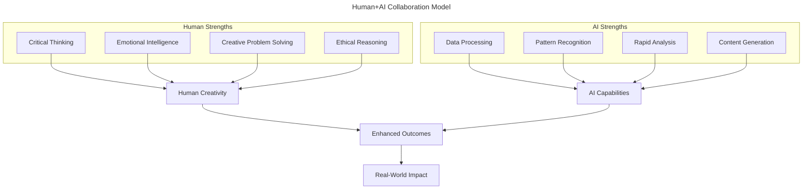
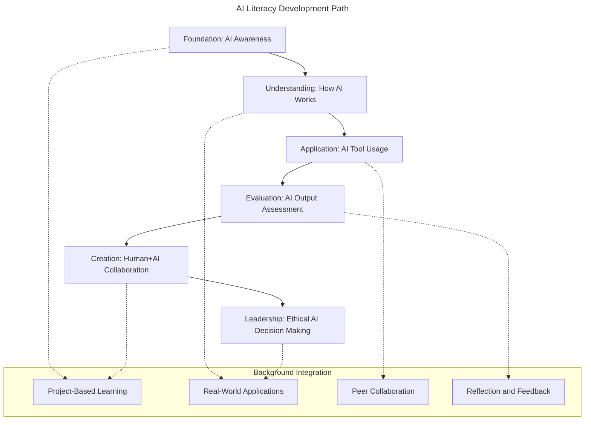

# AI Ethics Framework

## Vision Statement

Practera's AI ethics framework is grounded in the belief that artificial intelligence should enhance, not replace, human capabilities. Our mission is to prepare learners for a future where human+AI collaboration drives innovation, creativity, and meaningful work outcomes.

> 💡 **Core Philosophy:** We teach AI literacy in the background while developing uniquely human skills that remain irreplaceable in an AI-driven world.

## Strategic Context

According to the World Economic Forum's 2025 Future of Jobs Report:
- **Technological literacy** ranks #6 in core skills employers seek
- **AI and Big Data** skills rank #11 in demand
- **Entry-level roles** are increasingly automated by AI
- **Human skills** like creativity, analytical thinking, and social influence become more valuable

Practera positions learners to thrive in this evolving landscape by teaching them to leverage AI tools while strengthening distinctly human capabilities.

## Ethical Principles

### 1. Human-Centric AI Design

**Commitment**: AI serves as a powerful tool that amplifies human intelligence rather than replacing human judgment.

### 2. Transparency and Trust

- **Clear AI Disclosure**: Students are explicitly informed when AI evaluates their work
- **Algorithm Transparency**: Learners understand how AI tools function and their limitations
- **Bias Awareness**: Active education about AI biases and mitigation strategies
- **Feedback Loops**: Student input directly improves AI system quality

### 3. Educational Integrity

- **Authentic Learning**: AI usage enhances rather than diminishes learning objectives
- **Skill Development**: Focus on developing AI literacy alongside domain expertise
- **Assessment Validity**: Human oversight ensures fair and accurate evaluation
- **Academic Honesty**: Clear guidelines for appropriate AI usage in educational contexts

### 4. Privacy and Data Protection

- **Data Minimization**: Only necessary data used for educational purposes
- **Consent-Based**: Opt-in approach with full transparency about AI usage
- **Zero Retention**: No long-term storage of student interactions with AI
- **Data Rights**: Complete control over personal data and AI-generated content

### 5. Inclusive and Equitable AI

- **Bias Mitigation**: Continuous monitoring and correction of AI biases
- **Universal Access**: AI tools enhance rather than create barriers to learning
- **Cultural Sensitivity**: AI systems respect diverse backgrounds and perspectives
- **Accessibility**: AI features support learners with different abilities and needs

## Implementation Framework

### Core Skills Development

| Human Skill | AI Enhancement | Learning Outcome |
|:------------|:---------------|:-----------------|
| **Creativity** | AI-generated ideas as springboards | Original thinking and innovation |
| **Analytical Thinking** | AI data processing for deeper insights | Complex problem-solving abilities |
| **Social Influence** | AI communication optimization | Enhanced leadership and collaboration |
| **Adaptability** | AI trend analysis for informed decisions | Agility in changing environments |
| **Critical Evaluation** | AI output assessment and validation | Independent judgment and reasoning |

### AI Literacy Curriculum

### Assessment Philosophy

**Human-Centered Evaluation**:
- AI provides insights; humans make final judgments
- Student self-assessment of AI collaboration effectiveness
- Peer evaluation of human+AI project outcomes
- Instructor focus on uniquely human contributions

**Continuous Improvement**:
- Regular analysis of student feedback on AI interactions
- Iterative refinement of AI tools based on learning outcomes
- Longitudinal tracking of AI literacy development
- Industry alignment with emerging AI best practices

## Governance Structure

### Ethics Review Process

1. **Quarterly Assessment**: Regular review of AI usage patterns and outcomes
2. **Student Voice**: Formal mechanisms for learner feedback on AI experiences
3. **Faculty Input**: Educator perspectives on AI effectiveness in learning
4. **Industry Alignment**: Regular updates based on workforce AI trends
5. **External Review**: Annual third-party assessment of ethical AI practices

#### Risk Management

| Risk Category | Mitigation Strategy | Monitoring Method |
|:-------------|:-------------------|:------------------|
| **Over-reliance** | Human decision requirements | Decision audit trails |
| **Skill Atrophy** | Mandatory human-only activities | Competency assessments |
| **Bias Amplification** | Diverse testing and feedback | Bias detection algorithms |
| **Privacy Violation** | Zero-retention policies | Data flow audits |
| **Academic Dishonesty** | Clear usage guidelines | AI detection tools |

## Future-Ready Learning Outcomes

### Workplace Preparation

**AI-Enhanced Professionals**:
- Confident AI tool users who understand limitations
- Critical evaluators of AI-generated content
- Effective human+AI collaborators
- Ethical AI decision makers
- Adaptive learners who evolve with AI technology

**Uniquely Human Value**:
- Enhanced creativity through AI augmentation
- Stronger analytical thinking with AI insights
- Improved social influence via AI-optimized communication
- Greater adaptability through AI trend analysis
- Deeper ethical reasoning about AI implications

### Success Metrics

- **AI Literacy Assessment**: Standardized evaluation of AI understanding and usage
- **Human Skill Enhancement**: Measurable improvement in creativity, critical thinking, and social skills
- **Career Readiness**: Industry feedback on graduate AI collaboration capabilities
- **Ethical Awareness**: Demonstrated understanding of responsible AI practices
- **Innovation Capacity**: Evidence of novel human+AI problem-solving approaches

## Continuous Evolution

This ethics framework evolves with:
- Advances in AI technology and capabilities
- Changes in educational pedagogy and assessment
- Shifts in workplace AI adoption and requirements
- Updates to AI regulation and compliance standards
- Feedback from students, educators, and industry partners

> 🚨 **Commitment**: Practera pledges to maintain the highest ethical standards in AI education while preparing learners for a future where human+AI collaboration drives meaningful impact.

---

**Document Control**
- Next Review: January 2026
- Approval: Wes Sonnenreich, Co-CEO/CTO, Suzy Watson, CFO/COO
- Distribution: Company-wide, client risk/compliance teams