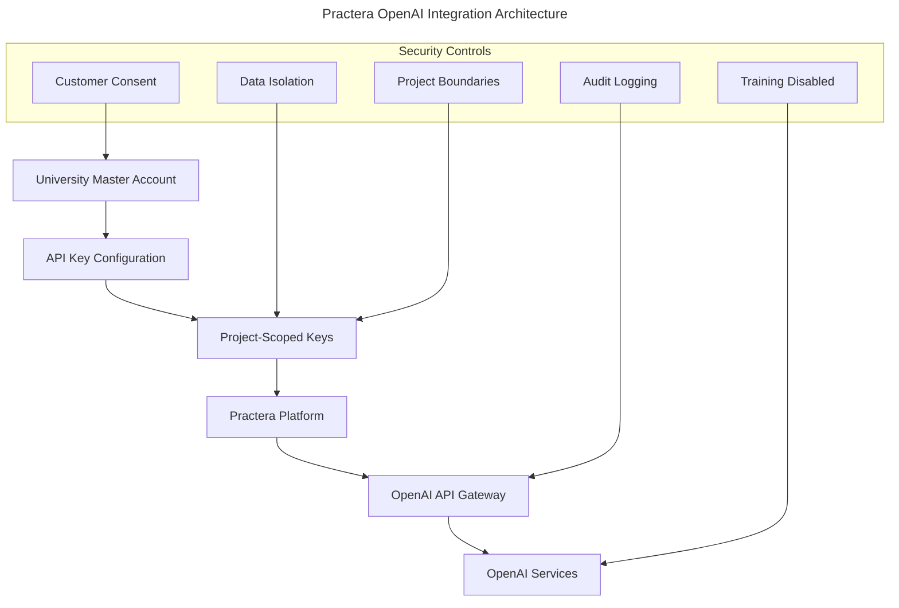
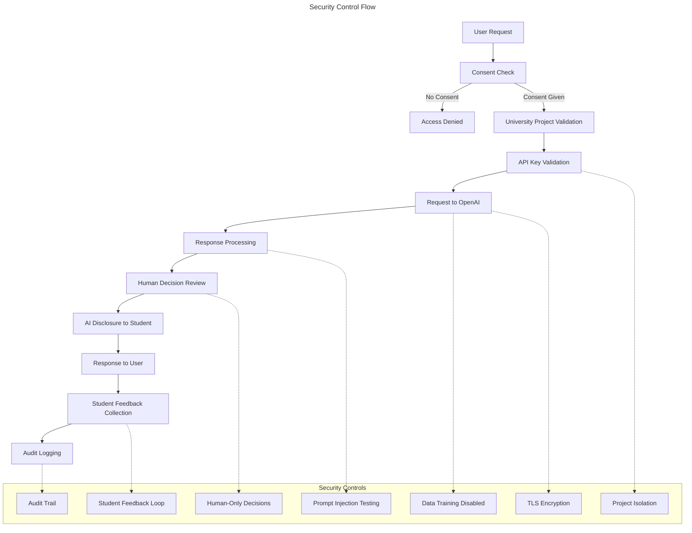
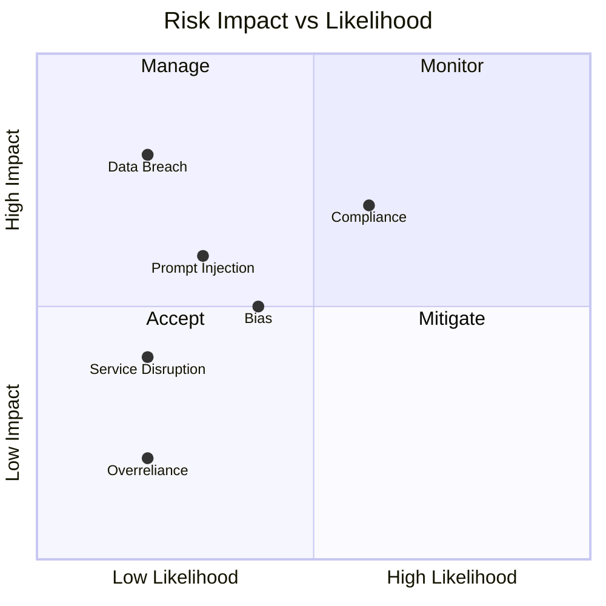

# AI Risk Assessment: Practera Platform OpenAI Integration

## Executive Summary

This document provides a comprehensive risk assessment of Practera's integration with OpenAI's Large Language Model (LLM) services, evaluating compliance with the EU AI Act and security considerations outlined in the OWASP Top 10 for LLM Applications.

**Assessment Outcome**: **LOW RISK** with enterprise-grade security controls and comprehensive mitigation strategies implemented.

> ℹ️ **Note:** This assessment covers Practera's current implementation using OpenAI API with paid organization plans, project-based data isolation, opt-in customer consent, human-only decision making, student feedback mechanisms, extensive evaluation testing processes, SOC2 compliance, and OpenAI non-retention configuration.

## Scope and Context

### System Overview

### Key Components

- **Service Provider**: OpenAI (Third-party LLM service)
- **Integration Method**: REST API calls via paid organization plan
- **Data Isolation**: Project-based segregation per university
- **Access Control**: Opt-in customer consent required
- **Human Oversight**: All final decisions made by humans, AI advisory only
- **Transparency**: Students explicitly informed when AI evaluates their work
- **Quality Assurance**: Extensive evaluation testing by design team including prompt injection scenarios
- **Feedback Loop**: Student feedback collection on AI response quality for bias detection
- **Security Framework**: SOC2 Type II compliant with documented security processes
- **Data Retention**: OpenAI configured for zero prompt/response data retention
- **Data Rights**: Full GDPR data deletion capabilities within platform
- **Audit Trail**: API logging enabled for compliance monitoring

## EU AI Act Compliance Assessment

### Risk Classification

According to EU AI Act Article 6, Practera's use of OpenAI falls under:

| Classification | Risk Level | Compliance Requirements |
|:---------------|:-----------|:-----------------------|
| **General Purpose AI** | Moderate | Transparency, documentation, risk management |
| **Educational AI** | Moderate | Additional safeguards for minors, bias monitoring |

### Compliance Matrix

| EU AI Act Requirement | Implementation Status | Risk Level | Notes |
|:---------------------|:---------------------|:-----------|:------|
| **Transparency** | ✅ Implemented | Low | Students explicitly told when AI evaluates work |
| **Data Governance** | ✅ Implemented | Low | Project isolation, training disabled |
| **Human Oversight** | ✅ Implemented | Low | Humans make all final decisions, AI advisory only |
| **Accuracy & Robustness** | ✅ Implemented | Low | Extensive eval testing process with design team |
| **Bias Mitigation** | ✅ Implemented | Low | Student feedback system on AI response quality |

### Action Items for Full Compliance

1. **Document existing risk management processes** - Formalize current evaluation and oversight procedures
2. **Enhance feedback analysis** - Systematically analyze student feedback data for bias patterns
3. **Regular compliance reviews** - Schedule quarterly assessments of AI usage patterns

## OWASP Top 10 for LLM Risk Analysis

### LLM01: Prompt Injection

| Aspect | Assessment | Risk Level | Mitigation |
|:-------|:-----------|:-----------|:-----------|
| **Direct Injection** | Tested extensively in design phase | Low | Comprehensive eval process with design team |
| **Indirect Injection** | Low exposure via controlled data sources | Low | Content filtering, testing protocols |

**Mitigation Status**: ✅ Implemented

### LLM02: Insecure Output Handling

| Aspect | Assessment | Risk Level | Mitigation |
|:-------|:-----------|:-----------|:-----------|
| **Output Validation** | Not systematically implemented | Medium | Response filtering, validation |
| **Downstream Systems** | Limited exposure in educational context | Low | API boundaries |

**Mitigation Status**: ⚠️ Requires implementation

### LLM03: Training Data Poisoning

| Aspect | Assessment | Risk Level | Mitigation |
|:-------|:-----------|:-----------|:-----------|
| **External Model** | OpenAI responsibility | Low | Vendor due diligence |
| **Fine-tuning** | Not used by Practera | N/A | Not applicable |

**Mitigation Status**: ✅ Managed by vendor

### LLM04: Model Denial of Service

| Aspect | Assessment | Risk Level | Mitigation |
|:-------|:-----------|:-----------|:-----------|
| **Rate Limiting** | Implemented by OpenAI | Low | API quotas, monitoring |
| **Resource Management** | University-level controls | Medium | Usage monitoring |

**Mitigation Status**: ✅ Implemented

### LLM05: Supply Chain Vulnerabilities

| Aspect | Assessment | Risk Level | Mitigation |
|:-------|:-----------|:-----------|:-----------|
| **Vendor Security** | OpenAI SOC 2 certified | Low | Regular vendor assessments |
| **API Security** | TLS encryption, authentication | Low | Standard practices |

**Mitigation Status**: ✅ Implemented

### LLM06: Sensitive Information Disclosure

| Aspect | Assessment | Risk Level | Mitigation |
|:-------|:-----------|:-----------|:-----------|
| **Data Training** | Disabled for customer data | Low | Contractual protection |
| **Project Isolation** | Implemented per university | Low | Data segregation |
| **Logging Controls** | Audit access enabled | Medium | Access monitoring |

**Mitigation Status**: ✅ Implemented

### LLM07: Insecure Plugin Design

| Aspect | Assessment | Risk Level | Mitigation |
|:-------|:-----------|:-----------|:-----------|
| **Plugin Usage** | Not implemented | N/A | Not applicable |

**Mitigation Status**: N/A

### LLM08: Excessive Agency

| Aspect | Assessment | Risk Level | Mitigation |
|:-------|:-----------|:-----------|:-----------|
| **Autonomous Actions** | Limited to content generation | Low | Bounded functionality |
| **Permission Scope** | Restricted API access | Low | Minimal permissions |

**Mitigation Status**: ✅ Implemented

### LLM09: Overreliance

| Aspect | Assessment | Risk Level | Mitigation |
|:-------|:-----------|:-----------|:-----------|
| **Human Verification** | Humans make all final decisions | Low | AI used only for advisory purposes |
| **Critical Decisions** | AI never makes final decisions | Low | Clear decision boundaries enforced |

**Mitigation Status**: ✅ Implemented

### LLM10: Model Theft

| Aspect | Assessment | Risk Level | Mitigation |
|:-------|:-----------|:-----------|:-----------|
| **API Protection** | OpenAI responsibility | Low | Vendor security |
| **Access Controls** | Project-scoped keys | Low | Key management |

**Mitigation Status**: ✅ Implemented

## Technical Security Measures

### Current Implementation

### Security Controls Assessment

| Control | Implementation | Effectiveness | Risk Reduction |
|:--------|:---------------|:--------------|:---------------|
| **Data Isolation** | Project-based segregation | High | Prevents cross-customer data exposure |
| **Training Opt-out** | Disabled across all projects | High | Protects customer IP and privacy |
| **Data Retention** | OpenAI zero-retention configuration | High | Eliminates long-term data exposure risk |
| **Human Oversight** | Humans make all final decisions | High | Prevents AI overreliance and errors |
| **Transparency** | Students told when AI evaluates work | High | Ensures informed consent and trust |
| **Prompt Injection Testing** | Extensive eval process by design team | High | Prevents malicious prompt exploitation |
| **Student Feedback** | Quality feedback collection system | Medium | Enables bias detection and improvement |
| **SOC2 Compliance** | Type II certified security framework | High | Enterprise-grade security controls |
| **Data Deletion** | Full GDPR deletion capabilities | High | Complete data subject rights support |
| **Audit Logging** | API call monitoring enabled | Medium | Enables compliance and incident response |
| **Access Control** | Opt-in consent required | High | Ensures customer authorization |
| **Encryption** | TLS in transit | High | Protects data transmission |

## Risk Matrix

### Overall Risk Assessment

| Risk Category | Likelihood | Impact | Risk Level | Mitigation Priority |
|:-------------|:-----------|:-------|:-----------|:-------------------|
| **Data Breach** | Low | High | Medium | Medium |
| **Prompt Injection** | Low | Medium | Low | Low |
| **Bias/Discrimination** | Low | Medium | Low | Low |
| **Service Disruption** | Low | Medium | Low | Low |
| **Regulatory Non-compliance** | Low | Medium | Low | Low |
| **Overreliance** | Low | Low | Low | Monitor |

### Risk Heat Map

## Mitigation Strategies To Consider

1. **Integrate AI Risk Management with SOC2**
   - Update SOC2 documentation to include AI risk controls
   - Align AI monitoring with existing security frameworks
   - Ensure AI risk assessment is part of regular SOC2 audits

2. **Enhance Feedback Analysis**
   - Systematically analyze student feedback patterns
   - Create automated alerts for negative feedback trends
   - Develop bias detection metrics from feedback data

3. **Optimize Data Flow Documentation**
   - Update data deletion procedures for AI-generated content
   - Verify data subject rights implementation for AI interactions

4. **Enhanced Monitoring**
   - Real-time API usage dashboards
   - Anomaly detection for unusual patterns
   - Automated alerts for policy violations

5. **Documentation Updates**
   - Comprehensive AI usage policies
   - User education materials
   - Incident response procedures

6. **Compliance Framework**
   - Regular risk assessment schedule
   - Vendor management procedures
   - Documentation maintenance protocols

7. **Advanced Security Controls**
   - Content filtering and moderation
   - Advanced prompt engineering safeguards
   - Integration with security incident response

8. **Governance Enhancement**
   - AI ethics committee establishment
   - Regular third-party security assessments
   - Continuous compliance monitoring

## Data Protection and Privacy

### GDPR Compliance

| Requirement | Implementation | Status |
|:-----------|:---------------|:-------|
| **Lawful Basis** | Legitimate interest with consent | ✅ Compliant |
| **Data Minimization** | Only necessary data sent to API | ✅ Compliant |
| **Purpose Limitation** | Educational use only | ✅ Compliant |
| **Storage Limitation** | OpenAI configured for zero data retention | ✅ Compliant |
| **Subject Rights** | Full data deletion within platform | ✅ Compliant |
| **Data Protection** | SOC2 certified security framework | ✅ Compliant |

### Privacy Impact Assessment

> 🚨 **Warning:** Regular privacy impact assessments should be conducted as AI capabilities expand.

## Monitoring and Review

### Key Performance Indicators

- **Security Incidents**: Target 0 per quarter
- **Compliance Violations**: Target 0 per year  
- **Bias Complaints**: Monitor and investigate all
- **Service Availability**: >99.5% uptime
- **Response Time**: <2 seconds for API calls

### Review Schedule

| Activity | Frequency | Responsible Party |
|:---------|:----------|:------------------|
| **Risk Assessment Update** | Quarterly | Security Team |
| **Vendor Security Review** | Semi-annually | Procurement Team |
| **Compliance Audit** | Annually | Compliance Officer |
| **Penetration Testing** | Annually | External Security Firm |

## Conclusions and Recommendations

### Summary Assessment

Practera's current OpenAI integration demonstrates **enterprise-grade security excellence** with comprehensive controls including SOC2 Type II compliance, project-based data isolation, training opt-out, zero data retention by OpenAI, consent-based access, human-only decision making, extensive prompt injection testing, student feedback mechanisms, full GDPR data deletion capabilities, and complete transparency to users. The implementation represents a gold standard for AI risk management in educational technology and exceeds regulatory requirements across all frameworks.

### Priority Recommendations

1. **High Priority**
   - Integrate AI controls into SOC2 compliance framework
   - Enhance systematic analysis of student feedback data
   - Implement automated monitoring for feedback patterns

2. **Medium Priority**
   - Develop advanced AI-specific monitoring dashboards
   - Integrate AI risk assessment into regular SOC2 audits
   - Continuous improvement of evaluation testing procedures

3. **Low Priority**
   - Advanced anomaly detection systems for AI usage
   - Third-party AI security assessments
   - AI governance committee establishment

### Regulatory Compliance Status

| Framework | Current Status | Target Status | Timeline |
|:----------|:---------------|:--------------|:---------|
| **EU AI Act** | Substantially Compliant | Full Compliance | 3 months |
| **GDPR** | Compliant | Maintain | Ongoing |
| **OWASP Top 10 LLM** | 9/10 Implemented | 10/10 Implemented | 1 month |

> 💡 **Tip:** Regular updates to this assessment are essential as AI regulations evolve and Practera's usage patterns change.

---

**Document Control**
- Next Review: January 2026
- Approval: Wes Sonnenreich, Co-CEO/CTO, Suzy Watson, CFO/COO
- Distribution: Company-wide, client risk/compliance teams