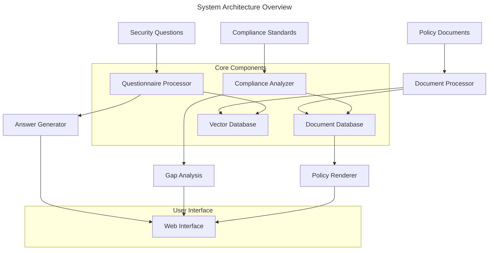

# PolySec - Security Policy Management System Requirements

## Overview

- **Purpose**: A comprehensive security policy management system that processes policy documents, answers security questionnaires, and performs compliance analysis
- **Project Objective**: Production
- **Target Users**: Security teams, compliance officers, auditors, and IT administrators
- **Business Value**: Automates security compliance workflows, reduces manual effort in policy management, and ensures comprehensive coverage of security requirements



## Functional Requirements

| ID | Requirement | Priority | Acceptance Criteria |
|----|-------------|----------|-------------------|
| F1 | Policy Document Ingestion | High | System accepts DOCX, PDF, and TXT files and extracts text/images |
| F2 | Document Database Storage | High | Documents stored in JSON format with searchable metadata |
| F3 | Vector Database Creation | High | Text sections converted to embeddings for semantic search |
| F4 | Policy Document Rendering | Medium | Documents displayed in web interface with original formatting |
| F5 | Security Questionnaire Processing | High | System generates answers from policy documents for given questions |
| F6 | Answer Validation | High | Generated answers validated against source documents |
| F7 | Compliance Gap Analysis | High | System identifies missing policies for SOC2, ISO 27001 standards |
| F8 | Artifact Coverage Analysis | Medium | System flags uncovered artifacts (pen tests, fire drills) |
| F9 | Web Interface | High | User-friendly interface for all system functions |
| F10 | Source Linking | High | Answers linked to relevant policy document sections |

## Non-Functional Requirements

| ID | Type | Requirement | Acceptance Criteria |
|----|------|-------------|-------------------|
| NF1 | Performance | Document processing under 30 seconds | 95% of documents processed within time limit |
| NF2 | Security | Data encryption at rest and in transit | All sensitive data encrypted using AES-256 |
| NF3 | Reliability | 99.9% uptime for web interface | System available 99.9% of operational hours |
| NF4 | Scalability | Support 10,000+ documents | System maintains performance with large document sets |
| NF5 | Accuracy | 95% accuracy in answer generation | Manual verification shows 95%+ relevance |
| NF6 | Usability | Intuitive web interface | Users complete tasks without training |

## Implementation Phases

### Phase 1: Document Management Foundation

**Scope**: Policy Document Database implementation

**Tasks**:
1. Set up project structure and dependencies
2. Implement document upload/storage system
3. Create document text extraction (PDF, DOCX, TXT)
4. Build JSON storage with metadata
5. Implement basic document rendering

**Deliverables**:
- Document upload API
- Text extraction service
- Document storage database
- Basic web interface for document management

**Checkpoint 1 Requirements**:
- [ ] **PAUSE FOR DOCUMENTATION**: Document all APIs, data models, and architecture decisions
- [ ] **PAUSE FOR REVIEW**: Human review of implementation approach and code quality
- [ ] **PAUSE FOR TESTING**: Create comprehensive test suite for document processing
- [ ] **PAUSE FOR VALIDATION**: Verify document upload and storage works with sample files

> 💡 **Tip**: Agent should not proceed to Phase 2 until all Checkpoint 1 requirements are completed and approved

### Phase 2: Vector Search Implementation

**Scope**: Semantic search capabilities and vector database

**Tasks**:
1. Integrate vector database (Pinecone/Weaviate/ChromaDB)
2. Implement text chunking strategies
3. Create embedding generation pipeline
4. Build semantic search functionality
5. Implement document section retrieval

**Deliverables**:
- Vector database integration
- Embedding pipeline
- Semantic search API
- Document section linking

**Checkpoint 2 Requirements**:
- [ ] **PAUSE FOR DOCUMENTATION**: Document vector database schema and search algorithms
- [ ] **PAUSE FOR REVIEW**: Human review of search accuracy and performance
- [ ] **PAUSE FOR TESTING**: Test semantic search with various query types
- [ ] **PAUSE FOR VALIDATION**: Verify search returns relevant document sections

### Phase 3: Question Processing Engine

**Scope**: Security questionnaire processor and answer generation

**Tasks**:
1. Implement AI-powered answer generation
2. Create question parsing and analysis
3. Build answer validation system
4. Implement confidence scoring
5. Create answer-to-source linking

**Deliverables**:
- Answer generation API
- Question processing engine
- Answer validation system
- Source reference linking

**Checkpoint 3 Requirements**:
- [ ] **PAUSE FOR DOCUMENTATION**: Document AI integration and answer generation logic
- [ ] **PAUSE FOR REVIEW**: Human review of answer quality and accuracy
- [ ] **PAUSE FOR TESTING**: Test with sample security questionnaires
- [ ] **PAUSE FOR VALIDATION**: Verify answers are accurate and properly sourced

### Phase 4: Compliance Analysis Engine

**Scope**: Compliance gap analysis and reporting

**Tasks**:
1. Implement compliance framework database (SOC2, ISO 27001)
2. Create gap analysis engine
3. Build compliance reporting
4. Implement artifact tracking
5. Create recommendation system

**Deliverables**:
- Compliance framework database
- Gap analysis engine
- Compliance reports
- Artifact tracking system

**Checkpoint 4 Requirements**:
- [ ] **PAUSE FOR DOCUMENTATION**: Document compliance frameworks and analysis algorithms
- [ ] **PAUSE FOR REVIEW**: Human review of compliance mapping accuracy
- [ ] **PAUSE FOR TESTING**: Test gap analysis with known compliance scenarios
- [ ] **PAUSE FOR VALIDATION**: Verify compliance reports are accurate and actionable

### Phase 5: Web Interface and Integration

**Scope**: Complete web interface and system integration

**Tasks**:
1. Build comprehensive web interface
2. Implement user authentication/authorization
3. Create dashboard and reporting views
4. Add export/import functionality
5. System optimization and polish

**Deliverables**:
- Complete web application
- User management system
- Reporting dashboard
- Export/import features

**Final Checkpoint Requirements**:
- [ ] **PAUSE FOR DOCUMENTATION**: Complete user documentation and admin guides
- [ ] **PAUSE FOR REVIEW**: Comprehensive system review and security audit
- [ ] **PAUSE FOR TESTING**: End-to-end testing with real-world scenarios
- [ ] **PAUSE FOR DEPLOYMENT**: Production deployment checklist and validation

## Data Models

### PolicyDocument
| Field | Type | Required | Description |
|-------|------|----------|-------------|
| id | string | Yes | Unique document identifier |
| title | string | Yes | Document title |
| version | string | No | Document version |
| uploadDate | datetime | Yes | Upload timestamp |
| fileType | enum | Yes | PDF, DOCX, TXT |
| content | json | Yes | Extracted text and metadata |
| sections | array | Yes | Document sections for search |
| status | enum | Yes | Processing status |

### SecurityQuestion
| Field | Type | Required | Description |
|-------|------|----------|-------------|
| id | string | Yes | Unique question identifier |
| question | string | Yes | Question text |
| category | string | No | Question category |
| framework | string | No | Associated compliance framework |
| answer | string | No | Generated answer |
| sources | array | No | Referenced document sections |
| confidence | number | No | Answer confidence score |

### ComplianceFramework
| Field | Type | Required | Description |
|-------|------|----------|-------------|
| id | string | Yes | Framework identifier |
| name | string | Yes | Framework name (SOC2, ISO 27001) |
| requirements | array | Yes | Framework requirements |
| controls | array | Yes | Control mappings |
| version | string | Yes | Framework version |

## API Contracts

### Document Upload
- **URL**: `/api/documents/upload`
- **Method**: POST
- **Authentication**: Required, Bearer token
- **Request**: Multipart form data with file
- **Response**:
  ```json
  {
    "id": "doc_123",
    "status": "processing",
    "message": "Document uploaded successfully"
  }
  ```

### Question Processing
- **URL**: `/api/questions/process`
- **Method**: POST
- **Authentication**: Required, Bearer token
- **Request**:
  ```json
  {
    "questions": ["What is our data retention policy?"],
    "framework": "soc2"
  }
  ```
- **Response**:
  ```json
  {
    "answers": [{
      "question": "What is our data retention policy?",
      "answer": "Generated answer text...",
      "sources": ["doc_123:section_5"],
      "confidence": 0.95
    }]
  }
  ```

### Compliance Analysis
- **URL**: `/api/compliance/analyze`
- **Method**: POST
- **Authentication**: Required, Bearer token
- **Request**:
  ```json
  {
    "framework": "soc2",
    "scope": "all_documents"
  }
  ```
- **Response**:
  ```json
  {
    "coverage": 0.85,
    "gaps": ["Access Control Policy", "Incident Response Plan"],
    "recommendations": ["Create missing policies", "Update existing controls"]
  }
  ```

## Testing Strategy

### Unit Tests
- Document text extraction functions
- Vector embedding generation
- Answer generation logic
- Compliance mapping algorithms

### Integration Tests
- End-to-end document processing pipeline
- Question-to-answer workflow
- Compliance analysis workflow
- API endpoint integration

### Security Tests
- Authentication and authorization
- Data encryption validation
- Input sanitization
- SQL injection prevention

### Performance Tests
- Large document processing
- Concurrent user handling
- Vector search performance
- Memory usage optimization

## Technical Stack

### Backend
- **Framework**: Next.js 15 with API routes
- **Database**: PostgreSQL with Prisma ORM
- **Vector Database**: ChromaDB or Pinecone
- **AI/ML**: OpenAI GPT-4 or equivalent
- **File Processing**: pdf-parse, mammoth (DOCX)

### Frontend
- **Framework**: Next.js 15 with React
- **Styling**: Tailwind CSS
- **State Management**: React Query
- **UI Components**: Shadcn/ui

### Infrastructure
- **Authentication**: NextAuth.js
- **File Storage**: AWS S3 or local filesystem
- **Deployment**: Vercel or Docker containers

## Dependencies

- OpenAI API for answer generation
- Vector database service (ChromaDB/Pinecone)
- Document parsing libraries
- File storage solution
- Authentication provider

## Constraints

- Must handle documents up to 100MB
- Response time under 10 seconds for answer generation
- Support for common document formats only
- English language support initially
- Cloud deployment compatible

## Security Considerations

> 🚨 **Warning**: This system will handle sensitive security documents

- All documents encrypted at rest
- Access control based on user roles
- Audit logging for all operations
- Secure API authentication
- Data retention policies
- GDPR/compliance requirements

## Success Metrics

- **Document Processing**: 95% success rate
- **Answer Accuracy**: 90% relevance score
- **Performance**: Sub-10-second response times
- **User Adoption**: 80% user satisfaction
- **Compliance Coverage**: 95% requirement mapping

## Open Questions

- Which vector database to use for production scale?
- How to handle document versioning and updates?
- What level of AI model customization is needed?
- How to measure and improve answer accuracy?
- What compliance frameworks to prioritize first?

---

> ℹ️ **Note**: This requirements document should be reviewed and approved before implementation begins. Each checkpoint requires human validation before proceeding to the next phase.