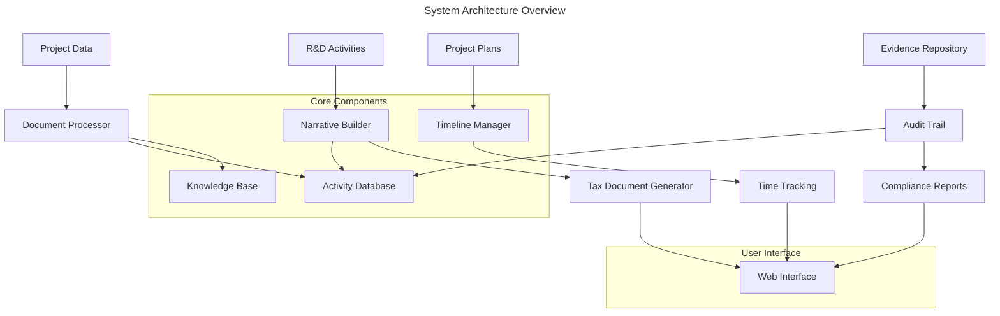

# r2dtax - R&D Tax Documentation Management System Requirements

## Overview

- **Purpose**: A comprehensive R&D tax documentation management system that processes project activities, builds tax narratives, manages project timelines, and tracks time against R&D activities
- **Project Objective**: Production
- **Target Users**: R&D managers, tax consultants, finance teams, project managers, and auditors
- **Business Value**: Automates R&D tax claim preparation, ensures compliance with tax requirements, reduces manual effort in documentation, and provides audit-ready evidence



## Functional Requirements

| ID | Requirement | Priority | Acceptance Criteria |
|----|-------------|----------|-------------------|
| F1 | R&D Activity Documentation | High | System captures core and supporting activities with hypothesis, experiments, conclusions |
| F2 | Narrative Builder | High | Generates R&D tax narratives from activity data following ATO requirements |
| F3 | Project Timeline Management | High | Creates and manages month-by-month project plans with activity tracking |
| F4 | Time Tracking System | High | Records and validates time spent against R&D activities with audit trails |
| F5 | Evidence Management | High | Stores and organizes supporting documentation and evidence |
| F6 | Compliance Validation | High | Validates activities against R&D tax eligibility criteria |
| F7 | Document Generation | High | Produces formatted tax documentation and submission reports |
| F8 | Knowledge Base Integration | Medium | Leverages knowledgebase for document analysis and content extraction |
| F9 | Collaborative Editing | Medium | Multiple users can contribute to activity documentation |
| F10 | Audit Trail Management | High | Maintains comprehensive audit logs for all system activities |

## Non-Functional Requirements

| ID | Type | Requirement | Acceptance Criteria |
|----|------|-------------|-------------------|
| NF1 | Performance | Document processing under 15 seconds | 95% of documents processed within time limit |
| NF2 | Security | Data encryption and access control | All sensitive data encrypted, role-based access |
| NF3 | Reliability | 99.9% uptime for document access | System available 99.9% of operational hours |
| NF4 | Scalability | Support 1,000+ projects per organization | System maintains performance with large datasets |
| NF5 | Accuracy | 98% accuracy in narrative generation | Manual validation shows 98%+ compliance accuracy |
| NF6 | Usability | Intuitive project management interface | Users complete tasks without extensive training |

## Implementation Phases

### Phase 1: Core Document Management Foundation

**Scope**: Basic project and activity management with document storage

**Tasks**:
1. Set up project structure and dependencies
2. Implement project creation and management
3. Create activity documentation system (core and supporting)
4. Build basic document upload/storage
5. Implement user authentication and organization management

**Deliverables**:
- Project management API
- Activity documentation database
- Document storage system
- Basic web interface for project management
- User authentication system

**Checkpoint 1 Requirements**:
- [ ] **PAUSE FOR DOCUMENTATION**: Document all APIs, data models, and database schema
- [ ] **PAUSE FOR REVIEW**: Human review of project structure and data modeling approach
- [ ] **PAUSE FOR TESTING**: Create comprehensive test suite for project and activity management
- [ ] **PAUSE FOR VALIDATION**: Verify project creation and activity documentation with sample data

> 💡 **Tip**: Agent should not proceed to Phase 2 until all Checkpoint 1 requirements are completed and approved

### Phase 2: Knowledge Base Integration and Content Processing

**Scope**: Integration with knowledgebase package for document analysis and content extraction

**Tasks**:
1. Integrate knowledgebase package for document processing
2. Implement document text extraction and analysis
3. Create content mapping to R&D activity structures
4. Build evidence linking system
5. Implement search and retrieval capabilities

**Deliverables**:
- Knowledgebase integration layer
- Document analysis pipeline
- Evidence management system
- Content search API
- Document viewer integration

**Checkpoint 2 Requirements**:
- [ ] **PAUSE FOR DOCUMENTATION**: Document knowledgebase integration and content processing workflows
- [ ] **PAUSE FOR REVIEW**: Human review of document processing accuracy and performance
- [ ] **PAUSE FOR TESTING**: Test document processing with various file types and content
- [ ] **PAUSE FOR VALIDATION**: Verify evidence linking and content extraction accuracy

### Phase 3: Narrative Builder and Tax Documentation Engine

**Scope**: AI-powered narrative generation and tax document creation

**Tasks**:
1. Implement R&D narrative builder using activity data
2. Create tax document templates and generators
3. Build compliance validation engine
4. Implement automated narrative structuring
5. Create document export and formatting system

**Deliverables**:
- Narrative generation engine
- Tax document templates
- Compliance validation system
- Document export functionality
- Formatted report generation

**Checkpoint 3 Requirements**:
- [ ] **PAUSE FOR DOCUMENTATION**: Document narrative generation logic and compliance rules
- [ ] **PAUSE FOR REVIEW**: Human review of generated narratives for accuracy and compliance
- [ ] **PAUSE FOR TESTING**: Test narrative generation with various project types and activities
- [ ] **PAUSE FOR VALIDATION**: Verify compliance with ATO requirements and document formatting

### Phase 4: Project Timeline and Planning System

**Scope**: Project planning, timeline management, and milestone tracking

**Tasks**:
1. Implement project timeline creation and management
2. Build month-by-month planning interface
3. Create milestone and deliverable tracking
4. Implement project progress monitoring
5. Build reporting and analytics dashboard

**Deliverables**:
- Project timeline management system
- Planning interface and tools
- Milestone tracking system
- Progress monitoring dashboard
- Project analytics and reporting

**Checkpoint 4 Requirements**:
- [ ] **PAUSE FOR DOCUMENTATION**: Document timeline management and planning algorithms
- [ ] **PAUSE FOR REVIEW**: Human review of planning interface and project tracking accuracy
- [ ] **PAUSE FOR TESTING**: Test timeline management with complex project scenarios
- [ ] **PAUSE FOR VALIDATION**: Verify project planning tools meet user workflow requirements

### Phase 5: Time Tracking and Resource Management

**Scope**: Time tracking system with validation and audit capabilities

**Tasks**:
1. Implement time tracking interface and backend
2. Create time validation and approval workflows
3. Build resource allocation and cost tracking
4. Implement audit trail and compliance reporting
5. Create time analysis and reporting tools

**Deliverables**:
- Time tracking system
- Validation and approval workflows
- Resource cost tracking
- Audit trail system
- Time analysis and reporting

**Checkpoint 5 Requirements**:
- [ ] **PAUSE FOR DOCUMENTATION**: Document time tracking workflows and validation rules
- [ ] **PAUSE FOR REVIEW**: Human review of time tracking accuracy and audit compliance
- [ ] **PAUSE FOR TESTING**: Test time tracking with various user roles and scenarios
- [ ] **PAUSE FOR VALIDATION**: Verify audit trail completeness and compliance reporting

### Phase 6: Advanced Features and Integration

**Scope**: Advanced reporting, collaboration, and system integration

**Tasks**:
1. Build comprehensive reporting and analytics
2. Implement collaborative editing and review workflows
3. Create advanced compliance checking and validation
4. Build API integrations for external systems
5. System optimization and performance tuning

**Deliverables**:
- Advanced reporting system
- Collaboration tools
- Enhanced compliance engine
- API integration capabilities
- Performance optimization

**Final Checkpoint Requirements**:
- [ ] **PAUSE FOR DOCUMENTATION**: Complete user documentation and system administration guides
- [ ] **PAUSE FOR REVIEW**: Comprehensive system review and security audit
- [ ] **PAUSE FOR TESTING**: End-to-end testing with real-world R&D project scenarios
- [ ] **PAUSE FOR DEPLOYMENT**: Production deployment checklist and validation

## Data Models

### Project
| Field | Type | Required | Description |
|-------|------|----------|-------------|
| id | string | Yes | Unique project identifier |
| name | string | Yes | Project name |
| reference | string | No | Project reference code |
| startDate | datetime | Yes | Project start date |
| endDate | datetime | Yes | Project end date |
| totalBudget | decimal | No | Total project budget |
| description | text | Yes | Project objectives and description |
| primaryContact | string | No | Primary technical contact |
| status | enum | Yes | active, completed, cancelled |
| organizationId | string | Yes | Multi-tenant isolation |

### RDActivity
| Field | Type | Required | Description |
|-------|------|----------|-------------|
| id | string | Yes | Unique activity identifier |
| projectId | string | Yes | Parent project reference |
| type | enum | Yes | core, supporting |
| name | string | Yes | Activity name |
| hypothesis | text | No | Research hypothesis |
| experiments | text | No | Experimental methodology |
| results | text | No | Results and conclusions |
| startDate | datetime | Yes | Activity start date |
| endDate | datetime | Yes | Activity end date |
| expenditure | decimal | No | Activity expenditure |
| status | enum | Yes | planned, active, completed |

### TimeEntry
| Field | Type | Required | Description |
|-------|------|----------|-------------|
| id | string | Yes | Unique time entry identifier |
| activityId | string | Yes | Related R&D activity |
| userId | string | Yes | User who performed work |
| date | date | Yes | Work date |
| hours | decimal | Yes | Hours worked |
| description | text | Yes | Work description |
| approved | boolean | No | Approval status |
| approvedBy | string | No | Approver user ID |
| evidenceFileId | string | No | Supporting evidence |

### RDNarrative
| Field | Type | Required | Description |
|-------|------|----------|-------------|
| id | string | Yes | Unique narrative identifier |
| projectId | string | Yes | Parent project reference |
| type | enum | Yes | core_activity, supporting_activity, project_summary |
| content | text | Yes | Generated narrative content |
| version | number | Yes | Version number |
| generatedAt | datetime | Yes | Generation timestamp |
| approved | boolean | No | Approval status |
| metadata | json | No | Generation metadata |

### Evidence
| Field | Type | Required | Description |
|-------|------|----------|-------------|
| id | string | Yes | Unique evidence identifier |
| projectId | string | Yes | Parent project reference |
| activityId | string | No | Related activity (optional) |
| fileId | string | Yes | Knowledgebase file reference |
| type | enum | Yes | document, experiment_data, literature_review |
| description | text | Yes | Evidence description |
| uploadedAt | datetime | Yes | Upload timestamp |
| uploadedBy | string | Yes | Uploader user ID |

## API Contracts

### Project Management
- **URL**: `/api/projects`
- **Method**: POST
- **Authentication**: Required, Bearer token
- **Request**:
  ```json
  {
    "name": "Novel AI Learning Systems",
    "reference": "INT20_01",
    "startDate": "2024-07-01",
    "endDate": "2025-06-30",
    "totalBudget": 4100000,
    "description": "Novel systems for experiential learning",
    "primaryContact": "Wes Sonnenreich"
  }
  ```
- **Response**:
  ```json
  {
    "id": "proj_123",
    "status": "created",
    "message": "Project created successfully"
  }
  ```

### Activity Documentation
- **URL**: `/api/projects/{projectId}/activities`
- **Method**: POST
- **Authentication**: Required, Bearer token
- **Request**:
  ```json
  {
    "type": "core",
    "name": "Data Analytics and ML System Development",
    "hypothesis": "Novel ML techniques can enable real-time learning analytics...",
    "experiments": "Development of temporal motifs and SNA methods...",
    "startDate": "2024-07-01",
    "endDate": "2025-06-30"
  }
  ```
- **Response**:
  ```json
  {
    "id": "activity_456",
    "status": "created",
    "message": "Activity documented successfully"
  }
  ```

### Narrative Generation
- **URL**: `/api/projects/{projectId}/narratives/generate`
- **Method**: POST
- **Authentication**: Required, Bearer token
- **Request**:
  ```json
  {
    "type": "core_activity",
    "activityId": "activity_456",
    "templateType": "ato_rdti"
  }
  ```
- **Response**:
  ```json
  {
    "narrativeId": "narrative_789",
    "content": "Generated narrative text...",
    "version": 1,
    "generatedAt": "2024-12-19T10:00:00Z"
  }
  ```

### Time Tracking
- **URL**: `/api/time-entries`
- **Method**: POST
- **Authentication**: Required, Bearer token
- **Request**:
  ```json
  {
    "activityId": "activity_456",
    "date": "2024-12-19",
    "hours": 8.0,
    "description": "Machine learning model development and testing"
  }
  ```
- **Response**:
  ```json
  {
    "id": "time_entry_101",
    "status": "recorded",
    "requiresApproval": true
  }
  ```

## Testing Strategy

### Unit Tests
- Project and activity CRUD operations
- Narrative generation algorithms
- Time tracking calculations and validations
- Compliance validation rules

### Integration Tests
- End-to-end project lifecycle management
- Knowledgebase integration workflows
- Document processing and evidence linking
- Time tracking and approval workflows

### Security Tests
- Authentication and authorization testing
- Data encryption validation
- Multi-tenant data isolation
- Audit trail integrity

### Performance Tests
- Large project and activity dataset handling
- Concurrent user time tracking
- Document processing performance
- Report generation speed

## Technical Stack

### Backend
- **Framework**: Next.js 15 with API routes
- **Database**: PostgreSQL with Prisma ORM
- **File Storage**: Vercel Blob (via knowledgebase package)
- **AI/ML**: OpenAI GPT-4 for narrative generation
- **Document Processing**: Integration with knowledgebase package

### Frontend
- **Framework**: Next.js 15 with React
- **Styling**: Tailwind CSS
- **State Management**: React Query
- **UI Components**: Shadcn/ui
- **Charts/Analytics**: Recharts or Chart.js

### Infrastructure
- **Authentication**: NextAuth.js
- **Deployment**: Vercel or Docker containers
- **Monitoring**: Application and performance monitoring
- **Backup**: Automated database and file backups

## Dependencies

- **Knowledgebase Package**: Document processing and storage
- **OpenAI API**: Narrative generation and content analysis
- **Authentication Provider**: User management
- **Database Service**: PostgreSQL hosting
- **File Storage**: Blob storage integration

## Constraints

- Must integrate with existing knowledgebase package
- Compliance with Australian R&D Tax Incentive requirements
- Support for large document sets (100MB+ files)
- Multi-tenant architecture for organization isolation
- Audit trail requirements for tax compliance

## Security Considerations

> 🚨 **Warning**: This system will handle sensitive financial and R&D data

- All documents and data encrypted at rest and in transit
- Role-based access control for different user types
- Comprehensive audit logging for all operations
- Secure API authentication and authorization
- Data retention policies for compliance requirements
- Regular security audits and penetration testing

## Success Metrics

- **Documentation Efficiency**: 80% reduction in manual narrative creation time
- **Compliance Accuracy**: 98% compliance with ATO requirements
- **User Adoption**: 90% user satisfaction with project management tools
- **Time Tracking Accuracy**: 95% accurate time allocation to R&D activities
- **Audit Readiness**: 100% audit trail completeness

## Parallel Development Strategy

### Integration with Knowledgebase Package
```typescript
// Leverage existing knowledgebase functionality
import { 
  DocumentService, 
  SearchService, 
  DocumentUpload 
} from '@jazzmind/knowledgebase';

// Use for R&D evidence management
<DocumentUpload 
  entityType="r2dtax"
  entityId="project-123"
  organizationId="your-org"
  onUploadComplete={(result) => {
    // Link evidence to R&D activities
    linkEvidenceToActivity(result.fileId, activityId);
  }}
/>
```

### Phase Transition Plan
1. **Phase 1 → Phase 2**: Add knowledgebase integration to existing project management
2. **Phase 2 → Phase 3**: Layer narrative generation on top of documented activities
3. **Phase 3 → Phase 4**: Add timeline management for project planning
4. **Phase 4 → Phase 5**: Integrate time tracking with project timelines
5. **Phase 5 → Phase 6**: Add advanced features and optimizations

### Development Milestones

#### Milestone 1: Foundation Complete (Week 2)
- [x] Project and activity management working
- [x] Basic document storage
- [x] User authentication and organizations
- [x] Core data models implemented

#### Milestone 2: Document Integration (Week 4)
- [ ] Knowledgebase package integration
- [ ] Evidence management system
- [ ] Document analysis and linking
- [ ] Search and retrieval capabilities

#### Milestone 3: Narrative Generation (Week 6)
- [ ] AI-powered narrative builder
- [ ] Tax document templates
- [ ] Compliance validation engine
- [ ] Document export capabilities

#### Milestone 4: Project Planning (Week 8)
- [ ] Timeline management system
- [ ] Month-by-month planning tools
- [ ] Milestone tracking
- [ ] Progress monitoring dashboard

#### Milestone 5: Time Tracking (Week 10)
- [ ] Time entry and validation system
- [ ] Approval workflows
- [ ] Resource cost tracking
- [ ] Audit trail management

#### Milestone 6: Production Ready (Week 12)
- [ ] Advanced reporting and analytics
- [ ] Collaboration features
- [ ] API integrations
- [ ] Performance optimization

## Open Questions

- Which specific ATO R&D Tax Incentive forms should be prioritized for template generation?
- How detailed should the time tracking granularity be (daily, hourly, task-level)?
- What level of AI automation is desired for narrative generation vs. human review?
- Should the system integrate with existing accounting or project management tools?
- What are the specific audit requirements and evidence standards for different R&D activities?

---

> ℹ️ **Note**: This requirements document should be reviewed and approved before implementation begins. Each checkpoint requires human validation before proceeding to the next phase. 