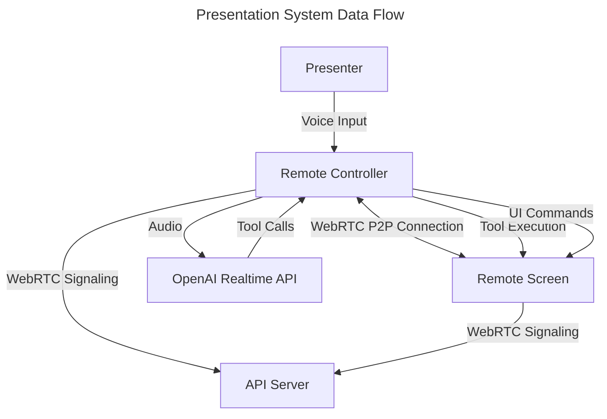

# Presentation Architecture

## Overview

The presentation system supports two deployment modes:
1. **Single Browser Mode**: Controller and display screen in the same browser (planned future implementation)
2. **Dual Browser Mode**: Separate browsers for controller and display screen (current implementation)

This document focuses on the current dual browser implementation.

## Dual Browser Architecture

### Components

The system consists of several interconnected components:

1. **RemoteController**: UI for the presenter
2. **RemoteScreen**: Display for the audience
3. **WebRTCConnection**: P2P communication between controller and screen
4. **RealtimeClient**: Interface to OpenAI's realtime streaming API
5. **Tools Framework**: Standardized presentation tools for AI interaction

### Data Flow

### Browser 1: Display Screen
- Generates a unique pairing code when initialized
- Waits for controller connection via WebRTC
- Receives and validates tool calls from the controller:
  - Slide navigation (next/previous)
  - Content updates
  - Timer controls
  - Voice transcript display
- Renders presentation slides with dynamic content
- Manages fullscreen mode and presentation UI

### Browser 2: Remote Controller
- Connects to display screen using pairing code
- Establishes WebRTC connection for low-latency communication
- Captures presenter's microphone input
- Streams audio to OpenAI's realtime API via `RealtimeClient`
- Provides standardized presentation instructions via `setupPresentationInstructions`
- Registers presentation tools via `setupPresentationTools`:
  - `updateSlide`: Updates slide content
  - `clearSlide`: Clears current slide
  - `nextSlide`: Advances to next slide
  - `previousSlide`: Returns to previous slide
- Processes AI responses and executes appropriate tool calls
- Sends commands to display screen via WebRTC
- Displays presentation notes and controls for the presenter

## Technical Implementation

- **WebRTC**: Enables peer-to-peer communication with minimal latency
- **OpenAI Realtime API**: Provides streaming audio processing and real-time AI responses
- **Modular Tools System**: Standardized interface for AI-invokable functions
- **Voice Activity Detection (VAD)**: Configurable settings for different use cases:
  - Server mode: Traditional pause detection
  - Semantic mode: Context-aware response timing

## Performance Considerations

Regarding the performance question:

Option 1 (Current Implementation): Controller processes audio with OpenAI API and sends tool calls to display
- **Advantages**:
  - Reduced bandwidth requirements (only tool calls are transmitted, not audio)
  - Presenter has direct control over AI processing
  - Lower latency for presenter feedback (sees transcription immediately)
  - Single point of API authentication and billing
  
Option 2 (Alternative): Controller sends audio to display, which processes with OpenAI API
- **Advantages**:
  - Display screen has direct access to AI processing results
  - Potentially better for network constraints (controller might have limited upload bandwidth)
  - Could reduce round-trip latency for tool execution
  - Better separation of concerns (display handles content, controller handles input)

**Recommendation**: The current implementation (Option 1) is likely the better approach because:
1. Tool calls require much less bandwidth than raw audio streaming
2. WebRTC data channels have very low latency (nearly imperceptible for tool execution)
3. Having the AI processing close to the audio input reduces potential audio quality degradation
4. Simplifies API key management and request attribution

For most presentation scenarios, the reduced bandwidth requirements and simplified architecture of Option 1 outweigh the potential benefits of Option 2. The current implementation creates a clear separation: the controller handles input and AI processing, while the display focuses on rendering and presentation.

