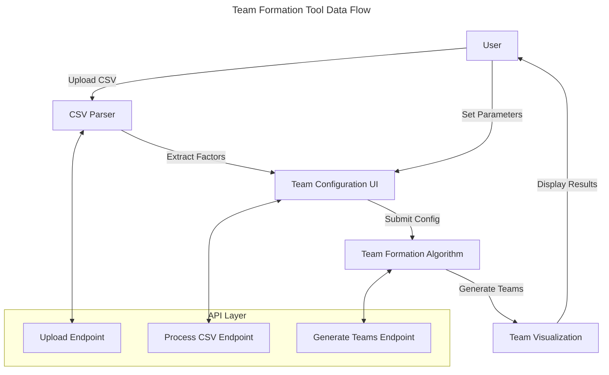

# Team Formation Tool Architecture

## Overview

The Team Formation Tool is designed to create balanced teams from a list of participants based on multiple factors. It supports:
1. **CSV Upload**: Import participant data with arbitrary factors
2. **Factor Configuration**: Set diversity and priority for each factor
3. **Team Size Optimization**: Adjust team size within constraints for optimal matching
4. **Visual Team Assignment**: Display team assignments with factor satisfaction metrics

## System Components

### Components

The system consists of several interconnected components:

1. **CSV Parser**: Processes uploaded CSV files and extracts headers/factors
2. **Team Configuration UI**: Interface for setting team size and factor parameters
3. **Team Formation Algorithm**: Core logic for creating balanced teams
4. **Team Visualization Component**: Visual representation of team assignments
5. **API Layer**: Endpoints for handling uploads and team formation requests

### Data Flow

## Technical Implementation

### CSV Parser
- Validates uploaded CSV format
- Extracts headers as potential grouping factors
- Normalizes data for algorithm consumption

### Team Configuration UI
- Dynamic form generation based on extracted factors
- Sliders for diversity settings (0-1 range)
- Priority selection (high, medium, low)
- Team size input with validation

### Team Formation Algorithm
The algorithm uses a multi-step approach:
1. **Data Preparation**: Normalize factor values across participants
2. **Diversity Scoring**: Calculate diversity scores for potential team combinations
3. **Priority Weighting**: Apply weights based on factor priorities
4. **Team Optimization**: Iteratively improve team assignments using a simulated annealing approach
5. **Size Adjustment**: Optimize by allowing teams to vary by ±1 member

### Algorithm Details

#### Diversity Scoring
- For categorical factors: Based on distribution of unique values
- For numerical factors: Based on standard deviation or range
- Combined score: Weighted sum based on diversity settings and priorities

#### Optimization Approach
The algorithm uses simulated annealing to avoid local optima:
1. Start with random team assignments
2. Make incremental swaps between teams
3. Accept improvements automatically
4. Accept some non-improvements based on decreasing probability
5. Repeat until convergence or iteration limit

### Team Visualization
- Card-based UI for each team
- Team name and member list
- Graphical representation of factor satisfaction
- Summary statistics across all teams

## API Endpoints

### `/api/teaming/upload`
- **Method**: POST
- **Purpose**: Upload and validate CSV file
- **Returns**: Extracted factors and sample data

### `/api/teaming/process`
- **Method**: POST
- **Purpose**: Process CSV data and extract factor information
- **Returns**: Factor metadata (types, ranges, unique values)

### `/api/teaming/generate`
- **Method**: POST
- **Purpose**: Generate team assignments based on configuration
- **Parameters**: 
  - CSV data
  - Factor settings (diversity, priority)
  - Team size parameters
- **Returns**: Team assignments with satisfaction metrics

## Testing Strategy

Testing focuses on algorithm correctness and UI functionality:

1. **Unit Tests**:
   - CSV parsing and validation
   - Diversity scoring functions
   - Team optimization algorithm
   - Factor normalization

2. **Integration Tests**:
   - End-to-end team formation with various inputs
   - Edge cases (extreme diversity settings)
   - Performance with large datasets

3. **Property-Based Tests**:
   - Verify team size constraints are maintained
   - Ensure all participants are assigned
   - Validate diversity metrics are correctly calculated

## Performance Considerations

- For large datasets (>1000 participants), the algorithm may require optimization
- Client-side processing is suitable for typical use cases (<200 participants)
- Server-side processing is used for larger datasets
- Caching of intermediate results to improve responsiveness 