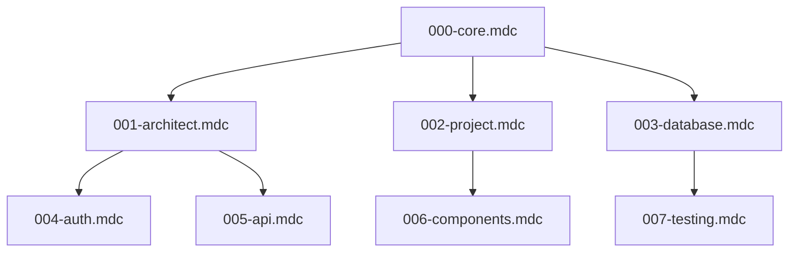

# Presenter Notes for 00SaaS Presentation

## Preparation Checklist
- [ ] Test RevealJS presentation in the browser
- [ ] Prepare the demo environment
- [ ] Check that all links work
- [ ] Review speaker notes in presentation mode (press 'S')

## Key Points to Emphasize

### On Cursor
- Despite its issues, Cursor offers a unique approach to AI coding
- The combination of agent mode + rules is powerful when used correctly
- Don't get discouraged by early bugs and limitations

### On 00SaaS
- The template is designed to be a starting point, not a final solution
- Multi-tenancy is handled at the database and authentication levels
- Edge-friendly architecture is built-in from the start

### On Vibe Coding
- Be diplomatic but clear about the reality vs. hype
- Focus on how AI augments developers rather than replaces them
- Emphasize the importance of understanding the problem space

## Demo Notes
- When showing the demo, highlight how the template handles:
  - User authentication
  - Tenant isolation
  - Edge deployment capabilities
- If time allows, show a quick example of using Cursor Rules to extend the template

## Resources Referenced in the Presentation

### Cursor Resources
- [Cursor Documentation](https://cursor.sh/docs/introduction)
- [Cursor Rules Documentation](https://docs.cursor.com/context/rules-for-ai)
- [Cursor GitHub Issues](https://github.com/getcursor/cursor/issues)

### NextJS Resources
- [NextJS Documentation](https://nextjs.org/docs)
- [NextJS Edge Runtime](https://nextjs.org/docs/api-reference/edge-runtime)

### 00SaaS Resources
- [00SaaS GitHub Repository](https://github.com/00saas)
- [Multi-tenancy Patterns Guide](https://www.prisma.io/dataguide/postgresql/multi-tenancy-patterns)

## 00SaaS Cursor Rules

The following links provide access to the complete rule files shown in the presentation. You can download these files and use them in your own projects:

### Core Rules
- [000-core.mdc](https://github.com/00saas/cursor-rules/blob/main/.cursor/rules/000-core.mdc) - Foundation rule for all Cursor rule creation
- [001-architect.mdc](https://github.com/00saas/cursor-rules/blob/main/.cursor/rules/001-architect.mdc) - System architecture guidelines for multi-tenant SaaS
- [002-project.mdc](https://github.com/00saas/cursor-rules/blob/main/.cursor/rules/002-project.mdc) - NextJS project structure and organization
- [003-database.mdc](https://github.com/00saas/cursor-rules/blob/main/.cursor/rules/003-database.mdc) - Multi-tenant database design and query patterns

### Additional Rules
- [004-auth.mdc](https://github.com/00saas/cursor-rules/blob/main/.cursor/rules/004-auth.mdc) - Authentication and authorization patterns
- [005-api.mdc](https://github.com/00saas/cursor-rules/blob/main/.cursor/rules/005-api.mdc) - API design and implementation
- [006-components.mdc](https://github.com/00saas/cursor-rules/blob/main/.cursor/rules/006-components.mdc) - UI component architecture
- [007-testing.mdc](https://github.com/00saas/cursor-rules/blob/main/.cursor/rules/007-testing.mdc) - Testing strategies for multi-tenant apps

### Getting Started with Cursor Rules

To use these rules in your own project:

1. Create a `.cursor/rules/` directory in your project
2. Copy the rule files you need into this directory
3. Configure VS Code settings:
   - Search for "Workbench: editor associations"
   - Add: `*.mdc` → `default`
4. Use Cursor with Agent mode to leverage these rules
5. When chatting with the agent, mention relevant aspects of your architecture to trigger the rules

### Rule Interaction Diagram

## Follow-up Questions to Anticipate

1. "How does 00SaaS handle scaling across multiple regions?"
2. "What authentication providers are supported?"
3. "How does the pricing model work for multi-tenant applications?"
4. "Can this approach work with existing codebases?"
5. "What are the security considerations for multi-tenant apps?"
6. "How do you deal with conflicting Cursor rules?"
7. "Can you share examples of successful projects built with this approach?"
8. "How do you handle database migrations with multi-tenant databases?" 