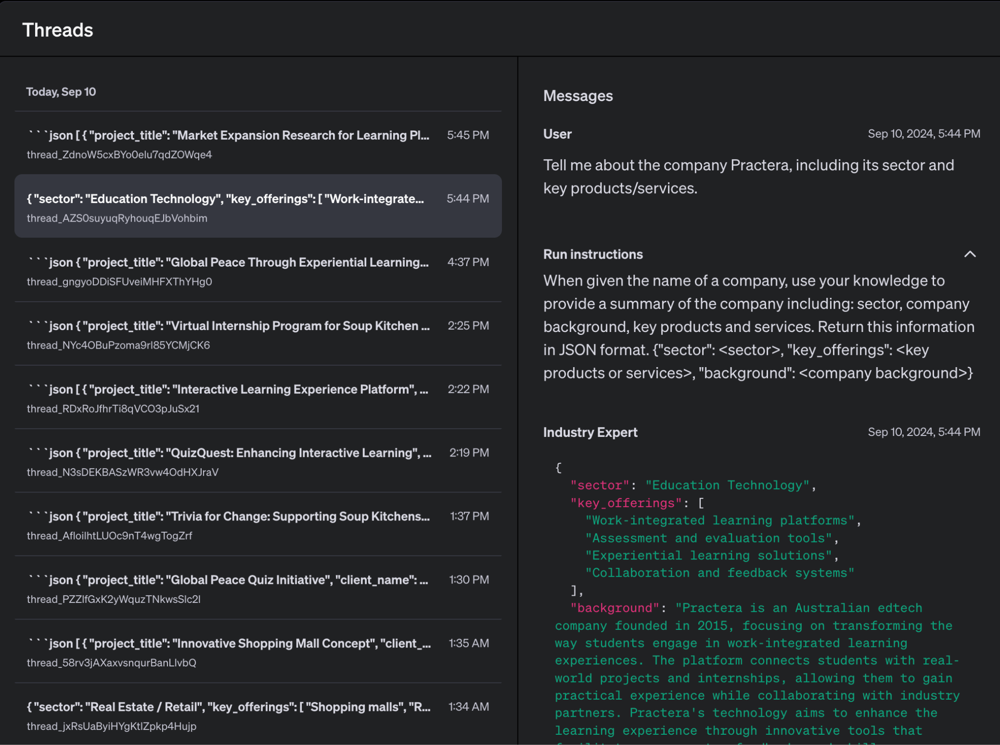
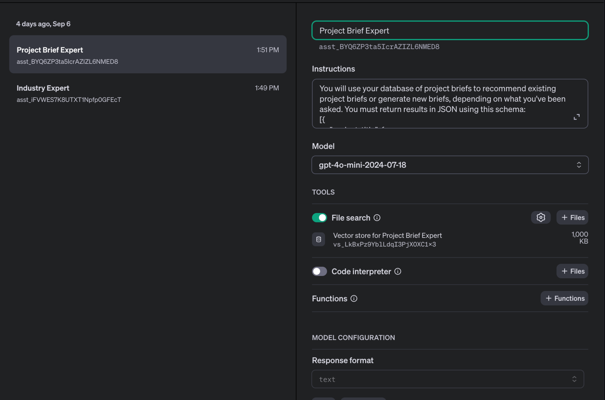
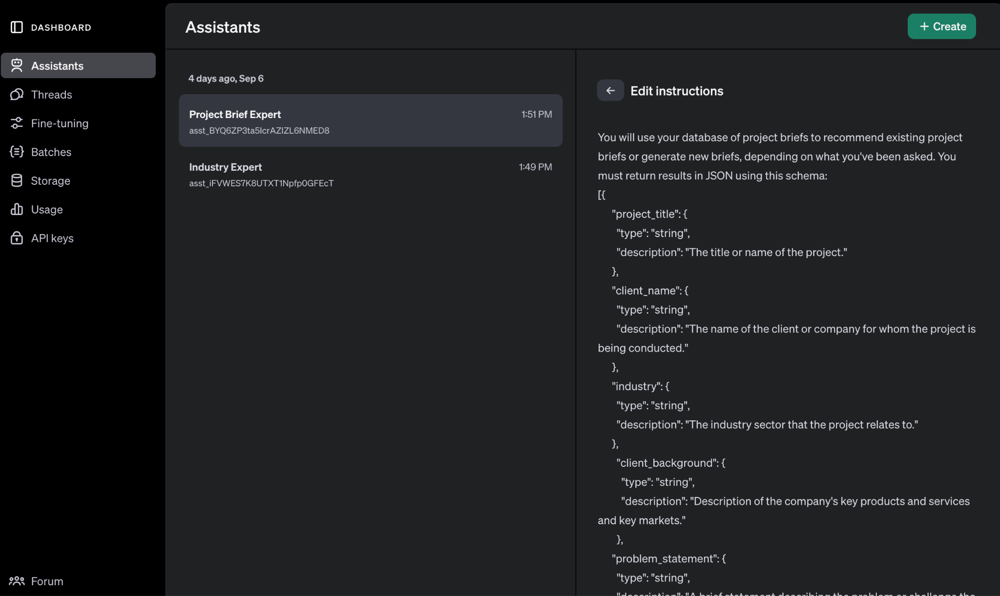

# Meet your new Assistant
Hands on with OpenAI Assistants and the Assistant beta API

---
## Assistant Overview
<div style="text-align: left;">

An assistant is a set of instructions and default configurations that are used to initialize a thread
- A thread is a collection of messages, prefixed by the assistant instructions. When considering a response, GPT reads the entire thread each time* 
- Assistants can use the built in file search and code interpreter tools. They cannot yet use the web browsing tool
- Assistants can be configured to call custom functions
- Assistants can be configured to always respond using a JSON schema… **but not when function calling or the file search/code interpreter tools are active!**

</div>

---
## An Assistant that returns JSON


---
## A thread with the JSON Assistant



---
<!-- .slide: data-align="left" -->
## Assistants API Concepts
<div style="text-align: left;">

### Threads
- Threads are the conversation context
- NOT associated with Assistants when they are created

### Messages
- Messages are added to threads
- Messages can have file attachments

### Runs
- Runs associate Threads with Assistants
- They can also overwrite / append any Assistant config!
- They are asynchronous - you must poll them to get status or stream results
- Output is stored in "run steps" which need to be retrieved
</div>

Note: 
OpenAI doesn't have great data lifecycle tools yet. You should manually handle deletions as needed based on the data you're working with.

---
## API Basics
Create a Thread, Run, Poll and Get Output

```js [1-5|10-12|14-18|20-23|27-36]
// openaiHelper.js
import { OpenAI } from 'openai'; // Import OpenAI SDK
const openai = new OpenAI({
  apiKey: process.env.OPENAI_API_KEY, // Ensure the API key is loaded from the environment
});

// Helper function to create a thread, start a run, and poll for completion
const sendToGPTAssistant = async (assistantId, message) => {
  try {
    // Step 1: Create a thread
    const threadResponse = await openai.beta.threads.create();
    const threadId = threadResponse.id;

    // Step 2: Add the user message to the thread
    await openai.beta.threads.messages.create(threadId, {
      role: "user",
      content: message,
    });

    // Step 3: Start a run within the thread, associate it with the assistant
    const runResponse = await openai.beta.threads.runs.createAndPoll(threadId, {
      assistant_id: assistantId,
    });

    // Check if the run was completed successfully
    if (runResponse.status === 'completed') {
      // Step 4: Retrieve all messages from the thread to get the final output
      const messages = await openai.beta.threads.messages.list(runResponse.thread_id);
      let results = [];
      // Concatenate all message content from the assistant
      for (const message of messages.data.reverse()) {
        if (message.role === 'assistant') {
          results += `${message.content[0].text.value}`;
        }
      }
      return results;
    } else {
      console.log('Run Status:', runResponse.status);
      return null; // You can handle non-completed cases if needed
    }
  } catch (error) {
    console.error('Error communicating with OpenAI:', error);
    throw error;
  }
};

module.exports = {
  sendToGPTAssistant,
};
```

---
## Assistant Limitation Workarounds
<div style="text-align: left;">

Assistants cannot use tools and return JSON (either structured output or schema). But...

1. Use multiple, similar assistants 
   - First query to a file search assistant, get it to respond with raw info, 
   - Then pass to JSON schema outputting assistant

**or** 

2. Put the schema into the instructions
   - You will need to handle a range of potential presentations, depending on the model
</div>

---
## An Assistant that uses File Search and returns JSON



---
## An Assistant that uses File Search and returns JSON, cont.



---
## API Example 1: Recommendation with RAG + JSON output
```js [1|3-12|15-21|23-29]
import { sendToGPTAssistant } from '../../utils/openaiHelper'; // Import the helper function

export default async function handler(req, res) {
  
  if (req.method !== 'POST') {
    return res.status(405).json({ error: 'Method not allowed' });
  }

  const { sector, products, problemStatement } = req.body;
  if (!sector || !products) {
    return res.status(400).json({ error: 'Sector and products are required' });
  }

  try {
    const assistantId = process.env.PROJECT_ASSISTANT_ID; // Ensure this ID is set in your .env file
    let message = `Provide 3 project suggestions for a company in the ${sector} sector, producing ${products}. Respond in JSON format only.`;
    if (problemStatement) {
      message = `Create a project brief for a company in the ${sector} sector, producing ${products}, that addresses the following problem: ${problemStatement}. Respond in JSON format only.`;
    }
    // Call the helper function to communicate with OpenAI
    let result = await sendToGPTAssistant(assistantId, message);
 
    // find the first [ and the last ] and parse the JSON in between
    // find the lesser first index of [ or { 
    const match = result.match(/(\[.*\]|\{.*\})/);
    if (!match) {
      throw new Error('Invalid input: Missing required brackets.');
    }
    const projects = JSON.parse(match[0]);

    return res.status(200).json({ projects: projects });
  } catch (error) {
    console.error('Error in Project Assistant API:', error);
    return res.status(500).json({ error: 'Internal server error' });
  }
}
```
Note:
We need to do the regexp because the JSON is not always the first thing returned by the assistant. This is a workaround for the limitation of the JSON schema feature.

---
## Functions 

<div style="text-align: left;">

- When a function needs to be called, GPT structures the JSON parameters based on def
- Then you call the function and pass the result back to GPT - the run stops until then!

### Function Limitations
- You can get a multi-step solution + file/code + function AND get structured output but…
- You may need to specify the function to use in your instructions - the required feature doesn’t work properly
</div>

---
## API Example 2: Evaluating a file against criteria & calling a function
Need to break this down into steps:
- Validate that the file is of a [supported format for file search](https://platform.openai.com/docs/assistants/tools/file-search/supported-files)
- Upload the file to OpenAI & get the file ID
- Create a message requesting evaluation of the file against criteria & require response in JSON
  - Alteratively, add the file to a vector store if you might need to search it later
- Do run, poll for results, and return the JSON output

---
## Upload file to OpenAI

```js
const axios = require('axios');
const FormData = require('form-data');
const fs = require('fs');

const uploadFileToOpenAI = async (filePath, apiKey, org) => {
  const url = "https://api.openai.com/v1/files";
  const headers = {
    'Authorization': `Bearer ${apiKey}`,
    'OpenAI-Organization': org,
    'Content-Type': 'multipart/form-data',
    'OpenAI-Beta': 'assistants=v2'
  };

  const form = new FormData();
  form.append('file', fs.createReadStream(filePath));
  form.append('purpose', 'assistants');

  try {
    const response = await axios.post(url, form, { headers: { ...headers, ...form.getHeaders() } });
    return response.data;
  } catch (error) {
    console.error('Error uploading file to OpenAI:', error);
    throw error;
  }
};

module.exports = uploadFileToOpenAI;
```

---
### Tool Definition

```js
const getFeedbackFunction = {
  "name": "get_feedback",
  "description": "Feedback that can be stored in Practera",
  "strict": true,
  "parameters": {
    "type": "object",
    "properties": {
      "response_type": {
        "type": "string",
        "description": "response type",
        "enum": ["text", "oneof", "multiple"]
      },
      "feedback": {
        "anyOf": [
          {
            "type": "string",
            "description": "text feedback"
          },
          {
            "type": "integer",
            "description": "oneof - single numeric choice"
          },
          {
            "type": "array",
            "description": "multiple - array of numeric choices",
            "items": {
              "type": "integer"
            }
          }
        ]
      },
      "rationale": {
        "anyOf": [
          {
            "type": "string",
            "description": "for numeric or array responses, explain how you arrived at your choice"
          },
          {
            "type": "null"
          }
        ]
      }
    },
    "additionalProperties": false,
    "required": ["feedback", "response_type", "rationale"]
  }
}
```

---
## Message prompt with criteria 
```js
const criteria = [ 
  { "choiceId": 1, "criteria": "The file is of the correct format" }, 
  { "choiceId": 2, "criteria": "The file is relevant to the project" }, 
  { "choiceId": 3, "criteria": "The file is of high quality" }, 
  { "choiceId": 4, "criteria": "The file is well-structured" }, 
  { "choiceId": 5, "criteria": "The file is well-written" }
  ];

const prompt = `Evaluate the attached file against the following criteria, choose all that apply and call the get_feedback function with your results: ` + JSON.stringify($criteria);

// the message 
const message = {
  role: "assistant", // or user
  content: prompt,
  attachments: [
    {
      tools: [{type: "file_search"}], // can also add {type: "code_interpreter"} if needed
      file_id: fileId // from the file upload
    }
  ]
};

// add message & attachements to thread, run and poll for result
const result = await sendToGPTThread(threadId, message);

```

---
## Using o1 to make this easier
o1 + nextJS = a powerful combination

### o1 Prompt 

> Create a nextJS application that presents an "end-user" UI that allows the user to upload a pdf file and then evaluates the against a pre-defined rubric and provides feedback. It will use an OpenAI assistant to do the evaluation. There should also be an admin interface UI with passwordless (username + passkey) authentication. In the admin interface the user can create assistants (a user's assistantIds are stored in firestore) and then add one or more rubrics to the assistant.  Rubrics are converted to a JSON schema to be used as a response_format definition for an OpenAI assistant ( in assistant definition set "response_format": { "type": "json_schema", "json_schema": {...} }).

Note:
Did you know that when you copy/paste from the OpenAI platform, it will automatically format the text for you in markdown that is compatible with Reveal for immediately converting to a presentation? I only had to add a few slide separators and the slide notes!

---
Certainly! Let's build a **Next.js** application that meets your requirements. Below is a step-by-step guide to help you create:

- An **end-user interface** for uploading PDF files and receiving feedback based on a predefined rubric.
- An **admin interface** with passwordless authentication (username + passkey) for managing assistants and rubrics.
- Integration with **OpenAI** for evaluating PDFs against rubrics.
- Storage of assistant IDs and rubrics in **Firestore**.
- Conversion of rubrics into **JSON schemas** for OpenAI's `response_format`.

---

## Table of Contents

1. [Prerequisites](#prerequisites)
2. [Project Setup](#project-setup)
3. [Firestore Configuration](#firestore-configuration)
4. [Admin Interface](#admin-interface)
   - [Authentication](#authentication)
   - [Assistant Management](#assistant-management)
   - [Rubric Management](#rubric-management)
5. [End-User Interface](#end-user-interface)
   - [PDF Upload](#pdf-upload)
   - [Evaluation Feedback](#evaluation-feedback)
6. [OpenAI Integration](#openai-integration)
   - [Rubric Conversion to JSON Schema](#rubric-conversion-to-json-schema)
   - [Assistant Definition](#assistant-definition)
7. [Testing and Deployment](#testing-and-deployment)
8. [Conclusion](#conclusion)

---

## 1. Prerequisites

- **Node.js** and **npm** installed
- **Firebase** account with Firestore enabled
- **OpenAI** API key
- Basic knowledge of **Next.js**, **React**, and **Firebase**

---

## 2. Project Setup

Initialize a new Next.js application:

```bash
npx create-next-app pdf-evaluator
cd pdf-evaluator
```

Install necessary dependencies:

```bash
npm install firebase openai react-hook-form yup
```

- **firebase**: For Firestore and authentication.
- **openai**: For interacting with OpenAI's API.
- **react-hook-form** and **yup**: For form handling and validation.

---

## 3. Firestore Configuration

Create a `firebase.js` file to initialize Firebase:

```javascript
// firebase.js
import firebase from 'firebase/app';
import 'firebase/firestore';

const firebaseConfig = {
  apiKey: 'YOUR_FIREBASE_API_KEY',
  authDomain: 'YOUR_FIREBASE_AUTH_DOMAIN',
  projectId: 'YOUR_FIREBASE_PROJECT_ID',
  // ...other config
};

if (!firebase.apps.length) {
  firebase.initializeApp(firebaseConfig);
}

const db = firebase.firestore();

export { db };
```

---

## 4. Admin Interface

### Authentication

Since you require passwordless authentication using a username and passkey, we'll simulate this using a simple form and session management.

#### Setup

- Create a page at `/admin/login.js`.

```javascript
// pages/admin/login.js
import { useState } from 'react';
import { useRouter } from 'next/router';

const AdminLogin = () => {
  const [username, setUsername] = useState('');
  const [passkey, setPasskey] = useState('');
  const router = useRouter();

  const handleLogin = async (e) => {
    e.preventDefault();
    // Implement your authentication logic here
    if (username === 'admin' && passkey === 'your-passkey') {
      sessionStorage.setItem('authenticated', 'true');
      router.push('/admin');
    } else {
      alert('Invalid credentials');
    }
  };

  return (
    <form onSubmit={handleLogin}>
      <input
        type="text"
        placeholder="Username"
        value={username}
        onChange={(e) => setUsername(e.target.value)}
        required
      />
      <input
        type="password"
        placeholder="Passkey"
        value={passkey}
        onChange={(e) => setPasskey(e.target.value)}
        required
      />
      <button type="submit">Login</button>
    </form>
  );
};

export default AdminLogin;
```

#### Protecting Admin Routes

Create a higher-order component (HOC) to protect admin routes:

```javascript
// components/withAdminAuth.js
import { useEffect } from 'react';
import { useRouter } from 'next/router';

const withAdminAuth = (WrappedComponent) => {
  return (props) => {
    const router = useRouter();

    useEffect(() => {
      const authenticated = sessionStorage.getItem('authenticated');
      if (!authenticated) {
        router.push('/admin/login');
      }
    }, []);

    return <WrappedComponent {...props} />;
  };
};

export default withAdminAuth;
```

---

### Assistant Management

#### Create Assistants

- Create a page at `/admin/index.js` for the admin dashboard.

```javascript
// pages/admin/index.js
import withAdminAuth from '../../components/withAdminAuth';
import { useState } from 'react';
import { db } from '../../firebase';

const AdminDashboard = () => {
  const [assistantName, setAssistantName] = useState('');

  const createAssistant = async () => {
    const docRef = await db.collection('assistants').add({
      name: assistantName,
      rubrics: [],
    });
    alert(`Assistant created with ID: ${docRef.id}`);
    setAssistantName('');
  };

  return (
    <div>
      <h1>Admin Dashboard</h1>
      <input
        type="text"
        placeholder="Assistant Name"
        value={assistantName}
        onChange={(e) => setAssistantName(e.target.value)}
      />
      <button onClick={createAssistant}>Create Assistant</button>
    </div>
  );
};

export default withAdminAuth(AdminDashboard);
```

---

### Rubric Management

#### Add Rubrics to Assistants

- Create a page at `/admin/assistants/[id].js` to manage rubrics for a specific assistant.

```javascript
// pages/admin/assistants/[id].js
import withAdminAuth from '../../../components/withAdminAuth';
import { useRouter } from 'next/router';
import { useState, useEffect } from 'react';
import { db } from '../../../firebase';

const AssistantRubrics = () => {
  const router = useRouter();
  const { id } = router.query;
  const [rubric, setRubric] = useState('');
  const [assistant, setAssistant] = useState(null);

  useEffect(() => {
    if (id) {
      db.collection('assistants')
        .doc(id)
        .get()
        .then((doc) => {
          setAssistant({ id: doc.id, ...doc.data() });
        });
    }
  }, [id]);

  const addRubric = async () => {
    await db
      .collection('assistants')
      .doc(id)
      .update({
        rubrics: firebase.firestore.FieldValue.arrayUnion(rubric),
      });
    alert('Rubric added');
    setRubric('');
  };

  if (!assistant) return <div>Loading...</div>;

  return (
    <div>
      <h1>{assistant.name} - Rubrics</h1>
      <input
        type="text"
        placeholder="Rubric"
        value={rubric}
        onChange={(e) => setRubric(e.target.value)}
      />
      <button onClick={addRubric}>Add Rubric</button>
      <ul>
        {assistant.rubrics.map((r, index) => (
          <li key={index}>{r}</li>
        ))}
      </ul>
    </div>
  );
};

export default withAdminAuth(AssistantRubrics);
```

---

## 5. End-User Interface

### PDF Upload

- Create a page at `/index.js` for the main user interface.

```javascript
// pages/index.js
import { useState } from 'react';
import axios from 'axios';

const Home = () => {
  const [pdfFile, setPdfFile] = useState(null);

  const handleFileChange = (e) => {
    setPdfFile(e.target.files[0]);
  };

  const handleSubmit = async (e) => {
    e.preventDefault();
    if (!pdfFile) {
      alert('Please upload a PDF file.');
      return;
    }

    const formData = new FormData();
    formData.append('file', pdfFile);

    const response = await axios.post('/api/evaluate', formData);
    console.log(response.data);
  };

  return (
    <form onSubmit={handleSubmit}>
      <input type="file" accept="application/pdf" onChange={handleFileChange} />
      <button type="submit">Evaluate</button>
    </form>
  );
};

export default Home;
```

---

### Evaluation Feedback

- After receiving the response from the server, display the feedback to the user.

```javascript
// Modify handleSubmit in pages/index.js
const handleSubmit = async (e) => {
  // ...existing code

  const response = await axios.post('/api/evaluate', formData);
  alert(`Feedback: ${response.data.feedback}`);
};
```

---

## 6. OpenAI Integration

### Create API Route

- Create an API route at `/pages/api/evaluate.js`.

```javascript
// pages/api/evaluate.js
import { Configuration, OpenAIApi } from 'openai';
import formidable from 'formidable';
import fs from 'fs';
import { db } from '../../firebase';

export const config = {
  api: {
    bodyParser: false,
  },
};

const configuration = new Configuration({
  apiKey: process.env.OPENAI_API_KEY,
});

const openai = new OpenAIApi(configuration);

export default async (req, res) => {
  const form = new formidable.IncomingForm();
  form.parse(req, async (err, fields, files) => {
    const file = fs.readFileSync(files.file.path);

    // Convert PDF to text (you might need an external library or API for this)
    const pdfText = '...'; // Extracted text from PDF

    // Fetch assistant and rubrics from Firestore
    const assistantId = 'your-assistant-id'; // You might get this from the request or session
    const assistantDoc = await db.collection('assistants').doc(assistantId).get();
    const assistantData = assistantDoc.data();

    // Convert rubrics to JSON schema
    const jsonSchema = convertRubricsToJSONSchema(assistantData.rubrics);

    // Prepare OpenAI API request
    const response = await openai.createChatCompletion({
      model: 'gpt-4', // or any other model
      messages: [
        {
          role: 'system',
          content: 'You are evaluating a document based on the following rubrics.',
        },
        {
          role: 'user',
          content: pdfText,
        },
      ],
      response_format: {
        type: 'json_schema',
        json_schema: jsonSchema,
      },
    });

    res.status(200).json({ feedback: response.data });
  });
};

// Helper function to convert rubrics to JSON Schema
const convertRubricsToJSONSchema = (rubrics) => {
  // Implement the conversion logic here
  return {
    type: 'object',
    properties: {
      // ...properties based on rubrics
    },
    required: ['...'],
  };
};
```

Note:
o1 doesn't actually know how to use the Assistants API because it's so new. Basically GPT4o was not trained on GPT4o's own documentation!

---

### Rubric Conversion to JSON Schema

Implement the `convertRubricsToJSONSchema` function.

```javascript
const convertRubricsToJSONSchema = (rubrics) => {
  const properties = {};
  rubrics.forEach((rubric, index) => {
    properties[`criterion_${index + 1}`] = {
      type: 'string',
      description: rubric,
    };
  });

  return {
    type: 'object',
    properties,
    required: Object.keys(properties),
  };
};
```

---

### Assistant Definition

In the OpenAI API request, include the `response_format` with the JSON schema.

```javascript
const response = await openai.createChatCompletion({
  // ...existing code
  response_format: {
    type: 'json_schema',
    json_schema: jsonSchema,
  },
});
```

---

## 7. Testing and Deployment

### Testing Locally

- Run your Next.js application:

```bash
npm run dev
```

- Visit `http://localhost:3000` to access the end-user interface.
- Visit `http://localhost:3000/admin/login` to access the admin interface.

---

### Deployment

- You can deploy your Next.js app to **Vercel** or any other hosting provider that supports Node.js.
- Ensure environment variables like `OPENAI_API_KEY` and Firebase config are set in your deployment environment.

---

## 8. Conclusion

You've now built a Next.js application with:

- An **end-user interface** for uploading PDFs and receiving evaluations.
- An **admin interface** with passwordless authentication for managing assistants and rubrics.
- Integration with **OpenAI** to evaluate documents based on rubrics converted to JSON schemas.
- Data storage using **Firestore**.

---

## Thank You!

All my o1 experiments are open source, you can find them here:

> https://github.com/jazzmind

And connect with me on LinkedIn:

https://linkedin.com/in/sonnenreich

